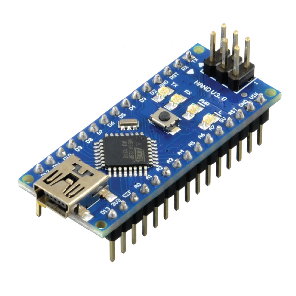
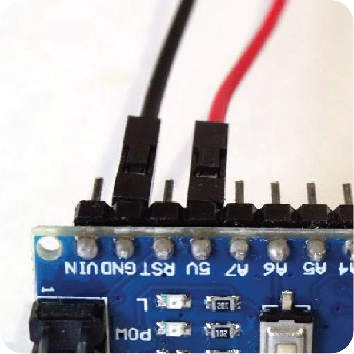

# Arduino Hardware ⚙️

## Apa itu _Hardware_ ❔

Istilah _Hardware_ terdiri dari dua kata yang berasal dari bahasa Inggris, yakni _Hard_ dan _Ware_. Dalam bahasa Indonesia, _Hard_ berarti "Keras" dan _Ware_ berarti "Perangkat". Jika digabungkan keduanya akan memiliki arti "Perangkat Keras" dalam bahasa Indonesia, yang mana sering kali digunakan sebagai istilah untuk segala benda yang dapat disentuh, diraba, dicium, ataupun didengar oleh kelima panca indera kita.

Misalnya, "Kabel Jumper" dan "Sensor Jarak Ultrasonik" merupakan _Hardware_ atau komponen dan modul elektronik yang akan sering kita sentuh dan sering kita gunakan ketika belajar dan membuat project bersama RoboKarsa.

&nbsp;&nbsp;&nbsp;

Kemudian, kita akan menemui istilah **Arduino Board**. Sama seperti kita menggunakan istilah **Produk Indomie**, berarti kita akan menyebutkan salah satu dari beberapa varian produk Arduino yang ada.

Begitu pula, jika kita menemui istilah **Arduino Board**, berarti kita akan menyebutkan salah satu satu dari beberapa varian perangkat Arduino yang ada.

Istilah **Board** dalam bahasa Inggris secara umum akan memiliki arti "Papan" dalam bahasa Indonesia. Namun, karena kita sedang membahas topik tentang robotika dan elektronika, istilah **Board** di sini digabungkan dengan nama **Arduino** menjadi **Arduino Board** yang secara langsung akan memiliki arti sebagai "Papan Mikrokontroller Arduino".

Mengapa disebut Papan Mikrokontroller?

Kalau teman-teman perhatikan gambar di atas, terdapat Arduino Uno yang sedang digenggam oleh tangan. Karena bentuknya yang seperti kartu seukuran telapak tangan tersebutlah produk Arduino kadang disebut sebagai Board maupun Microcontroller Board (Papan Mikrokontroller).

Kemudian mengapa papan tersebut juga disebut sebagai "Mikrokontroller"?

Untuk menjawab pertanyaan tersebut, mari kita cari tahu dahulu arti "Mikrokontroller". Mikrokontroller terdiri dari dua kata yakni, Mikro dan Kontroller.

Mikro merupakan istilah untuk menyebutkan ukuran suatu benda yang kecil, dan sesuai namanya, ukuran benda tersebut pastilah berukuran mikro. Kemudian Kontroller adalah sebuah perangkat yang dapat bekerja sebagai komputer dan memiliki fungsi untuk mengontrol suatu pekerjaan elektronika atau menjalankan suatu perangkat elektronik lainnya.

Maka, dari dua pengertian di atas, Mikrokontroller adalah perangkat berukuran kecil yang berfungsi untuk mengontrol suatu pekerjaan elektronika atau menjalankan suatu perangkat elektronik. Atau secara singkat, bisa kita sebut sebagai "Komputer Mini".

Arduino Uno pada gambar di atas sebelumnya merupakan Papan Mikrokontroller karena ukurannya yang kecil seukuran telapak tangan serta bisa digunakan untuk mengontrol suatu pekerjaan elektronik atau perangkat elektronik.

Papan Mikrokontroller yang dibuat oleh **Arduino** tidak hanya Arduino Uno saja, namun juga terdapat beragam jenis seperti Arduiino Nano, Arduino Mega, Arduino Promini dan masih banyak lagi. Teman-teman bisa melihat apa saja produk yang dibuat oleh **Arduino** pada gambar di bawah ini.

Karena Arduino memiliki banyak produk, sehingga tidak mungkin dijabarkan semua produk tersebut secara satu-persatu. Jika teman-teman penasaran apa saja produk yang dibuat oleh Arduino dan fungsi serta fitur-fiturnya, teman-teman dapat mengakses tautan <a target="_blank" rel="noopener noreferrer" href="https://www.arduino.cc/en/hardware">**Ini**</a>.

Namun, karena di RoboKarsa, kita akan menggunakan Arduino Nano sebagai komponen utama kita untuk belajar, kita akan menceritakan beberapa detail tentang Arduino Nano agar teman-teman bisa menggunakannya untuk belajar bersama RoboKarsa nantinya. Di bawah ini adalah gambar dari Arduino Nano yang akan sering kita lihat selama belajar bersama RoboKarsa nantinya.

## Komponen-Komponen Arduino Nano

Pemilihan mikrokontroller Arduino Nano ini didasarkan pada harganya yang lebih terjangkau serta ukurannya yang kecil dan ringkas, namun memiliki fitur-fitur yang relatif cukup lengkap. Berikut ini komponen-komponen penting dari Arduino Nano yang harus diketahui oleh teman-teman terlebih dahulu.

| No  | Nama Part                       | Keterangan                                                                                                                                                                                                                                                                                                              |
| :-: | ------------------------------- | ----------------------------------------------------------------------------------------------------------------------------------------------------------------------------------------------------------------------------------------------------------------------------------------------------------------------- |
|  1  | USB Jack Mini Type B Port       | Komponen ini digunakan untuk menghubungkan Arduino Nano dengan komputer melalui kabel data yang tersedia. Hasil pemrograman dan perintah yang telah dibuat pada komputer masuk melalui komponen ini.                                                                                                                    |
|  2  | Male Pin Header                 | Disebut “_Male_” karena merupakan pin yang jenisnya memanjang seperti paku dan digunakan untuk menghubungkan kabel jumper dengan kaki-kaki pada chip mikrokontroller.                                                                                                                                                   |
|  3  | Lampu LED                       | Komponen ini umumnya digunakan untuk mengetahui apakah board Arduino Nano bekerja dengan baik melalui program `Blink` yang tersedia. Lampu LED ini juga terhubung dengan pin D13.                                                                                                                                       |
|  4  | Power Indicator                 | Berfungsi untuk menunjukkan bahwa Arduino Nano telah terhubung dengan sumber tegangan yang bisa didapatkan dari pin VIN, 5V, atau melalui USB Port. Apabila lampu Powerr Indicator tidak menyala, maka terdapat kemungkinan bahwa sumber tegangan tidak terhubung dengan baik.                                          |
|  5  | RX Indicator                    | Lampu indikator yang akan berkedip apabila Arduino Nano sedang dalam proses menerima (Receiving) data dari komputer atau modul lain seperti modul bluetooth.                                                                                                                                                            |
|  6  | TX Indicator                    | Lampu indikator yang akan berkedip apabila Arduino Nano sedang dalam proses mengirim (Transmitting) data dari Arduino Nano ke komputer atau smartphone dengan modul bluetooth/modul WiFi.                                                                                                                               |
|  7  | Reset Button                    | Merupakan tombol reset yang berfungsi untuk me-reset atau menjalankan ulang program dari awal.                                                                                                                                                                                                                          |
|  8  | Microcontroller Chip AtMega 328 | Di dalam kepala manusia, terdapat otak yang berguna sekali bagi manusia. Otak mengendalikan gerak tubuh kita. Kita bisa berpikir dan berhitung karena adanya Otak. Nah, Arduino Nano juga memiliki otak yang disebut sebagai Chip. Disinilah tempat semua program dan perintah yang kita tulis disimpan dan dijalankan. |

:::info Info

Teman-teman tidak perlu menghafal semuanya sekaligus saat ini. Yang penting teman-teman mengetahui nama dan fungsi utamanya saja terlebih dahulu.

:::

## Pin-Pin Arduino Nano

Jika teman-teman perhatikan dengan seksama pada gambar di atas, komponen yang ditunjukk oleh panah biru memiliki nama yakni, Pin.

Pin-pin tersebut pada gambar di atas belum terpasang ke lubang pin Arduino Nano, atau disebut sebagai "_Pin Holes_" (Hole artinya lubang dalam bahasa Inggris) seperti ditunjuk oleh tanda panah biru pada gambar di atas.

Dari bentuk nya yang seperti paku, Pin pada gambar tersebut merupakan pin berjenis "Male", dan berfungsi untuk untuk menghubungkan lubang pin (_Pin Holes_) dengan kabel jumper seperti ditunjukkan pada gambar di bawah ini.

<a target="_blank" rel="noopener noreferrer" href="https://www.instructables.com/RS485-Serial-Communication-Between-Arduino-Mega-an"><strong>Sumber Gambar</strong></a>

Apabila pin-pin tersebut sudah terpasang dan terhubung pada Pin Holes yang terdapat pada Arduino Nano seperti pada gambar di bawah ini.

Pin-pin tersebut akan memiliki nama sesuai dengan tanda teks putih yang tertulis pada Arduino Nano.

Pada dasarnya, pin-pin ini bisa kita anggap sebagai pintu keluar masuk data untuk berkomunikasi dengan Arduino Nano. Setiap pin memiliki nama dan fungsi yang berbeda.
Berikut nama dan fungsi dari setiap pin yang ada pada Arduino Nano. Perlu diingat juga, ada beberapa pin pada Arduino Nano yang memiliki dua fungsi sekaligus atau fungsi alternatif. Pin tersebut ditandai dengan warna yang berbeda.

Sebagai permulaan, kita akan memberitahu terlebih dahulu makna Input dan Output pada kata "Digital Pin Input Output" dan "Analog Pin Input Output".

_Input_ merupakan kata dari bahasa Inggris yang berarti "Masukan". _Output_ juga merupakan kata yang berasal dari bahasa Inggris yang berarti "Keluaran". Apa yang menjadi Masukan dan Keluaran nya? Yang menjadi Masukan dan Keluaran nya adalah "sinyal".

Sebagai contoh, jika kita memberikan logika `HIGH` pada pin D13 sehingga membuat lampu LED Indicator menyala, berarti pin D13 sedang berfungsi sebagai _Output_, yakni pin yang berfungsi untuk memberikan sinyal tegangan 5V dari Arduino Nano kepada lampu LED Indicator untuk menyala.

Contoh lainnya, jika kita ingin membaca nilai Potensiometer menggunakan pin D13, kemudian menampilkan nilainya pada layar laptop kita, itu berati pin D13 sedang berfungsi sebagai _Input_, yakni pin yang berfungsi untuk menerima sinyal dari Potensiometer ke dalam Arduino Nano.

Pin Digital dan Analog bisa berfungsi sebagai Input (menerima sinyal dari luar Arduino Nano ke dalam Arduino Nano) atau bisa juga berfungsi sebagai Output (memberikan sinyal dari dalam Arduino Nano ke luar Arduino Nano). Tergantung bagaimana kita menugaskan pin tersebut. Apakah kita menugaskan pin tersebut sebagai _Input_ atau kita menugaskan pin tersebut sebagai _Output_.

Kecuali pin Analog A4 dan pin Analog A5 tidak direkomendasikan untuk digunakan sebagai Input. Serta pin Analog A6 dan pin Analog A7 hanya bisa digunakan sebagai Analaog Inputs.

Kita akan belajar lebih dalam bagaimana menugaskan pin-pin tersebut dengan sebagai Input atau Output yang kita inginkan. Namun, sebelum itu, mari kita mari kita kenali terlebih dahulu nama dan fungsi-fungsi keseluruhan dari Pin-Pin yang ada pada Arduino Nano.

### Keterangan Pin-Pin Arduino Nano

:::info Info

Tidak perlu harus menghafal semua pin nya sekaligus saat ini. Teman-teman bisa membacanya saja terlebih dahulu.

:::

| Nama Pin | Deskripsi                   | Keterangan                                                                                                                                                                                                                                                                                                                                                                                                                                                                                                                                                                              |
| :------: | --------------------------- | --------------------------------------------------------------------------------------------------------------------------------------------------------------------------------------------------------------------------------------------------------------------------------------------------------------------------------------------------------------------------------------------------------------------------------------------------------------------------------------------------------------------------------------------------------------------------------------- |
|    D0    | Digital Pin Input Output 0  | Pin D0 juga dapat digunakan sebagai pin RX0, yaitu pin yang digunakan untuk fungsi komunikasi Serial. Dari namanya, RX merupakan singkatan dari _Receiving_, yaitu pin yang bertugas untuk menerima data.                                                                                                                                                                                                                                                                                                                                                                               |
|    D1    | Digital Pin Input Output 1  | Pin D1 juga dapat digunakan sebagai pin TX1, yaitu pin yang digunakan untuk fungsi komunikasi Serial. Dari namanya, TX merupakan singkatan dari _Transmitting_, yaitu pin yang bertugas untuk mengirim data. Kita akan belajar lebih dalam tentang pin TX0 dan RX1 ini nantinya                                                                                                                                                                                                                                                                                                         |
|    D2    | Digital Pin Input Output 2  | -                                                                                                                                                                                                                                                                                                                                                                                                                                                                                                                                                                                       |
|    D3    | Digital Pin Input Output 3  | Jika teman-teman perhatikan, terdapat tanda ~ di sebelah pin D3. Tanda ~ disebut juga sebagai tanda _Wave_ atau Gelombang, tanda ini menunjukkan bahwa pin D3 dapat memberikan sinyal PWM (Pulse Width Modulation atau Modulasi Lebar Pulsa). Kita dapat menggunakan sinyal PWM untuk menggerakkan motor Servo dan Motor DC, yang mana akan kita pelajari nantinya.                                                                                                                                                                                                                     |
|    D4    | Digital Pin Input Output 4  | -                                                                                                                                                                                                                                                                                                                                                                                                                                                                                                                                                                                       |
|    D5    | Digital Pin Input Output 5  | Pin D5 juga bisa memberikan sinyal PWM.                                                                                                                                                                                                                                                                                                                                                                                                                                                                                                                                                 |
|    D6    | Digital Pin Input Output 6  | Pin D6 juga bisa memberikan sinyal PWM.                                                                                                                                                                                                                                                                                                                                                                                                                                                                                                                                                 |
|    D7    | Digital Pin Input Output 7  | -                                                                                                                                                                                                                                                                                                                                                                                                                                                                                                                                                                                       |
|    D8    | Digital Pin Input Output 8  | -                                                                                                                                                                                                                                                                                                                                                                                                                                                                                                                                                                                       |
|    D9    | Digital Pin Input Output 9  | Pin D9 juga bisa memberikan sinyal PWM.                                                                                                                                                                                                                                                                                                                                                                                                                                                                                                                                                 |
|   D10    | Digital Pin Input Output 10 | Pin D10 juga bisa memberikan sinyal PWM.                                                                                                                                                                                                                                                                                                                                                                                                                                                                                                                                                |
|   D11    | Digital Pin Input Output 11 | Pin D11 juga bisa memberikan sinyal PWM.                                                                                                                                                                                                                                                                                                                                                                                                                                                                                                                                                |
|   D12    | Digital Pin Input Output 12 | -                                                                                                                                                                                                                                                                                                                                                                                                                                                                                                                                                                                       |
|   D13    | Digital Pin Input Output 13 | Output Pin D13 ini juga terhubung pada Lampu LED Indicator yang terdapat pada Arduino Nano. Perhatikan kembali **[Komponen-Komponen Arduino Nano ](/docs/tutorial-arduino/arduino-hardware#komponen-komponen-arduino-nano)**, dan temukan letak lampu LED Indicator yang dimaksud. Apabila kita memberikan logika `HIGH` pada pin D13, akan menyalakan lampu LED Indicator tersebut. Sedangkan jika kita memberikan logika LOW pada pin D13, akan mematikan lampu LED Indicator tersebut. Kita akan mempelajari lebih lanjut tentang ini pada materi pemrograman pertama kita nantinya. |
|    A0    | Analog Pin Input Output 0   | -                                                                                                                                                                                                                                                                                                                                                                                                                                                                                                                                                                                       |
|    A1    | Analog Pin Input Output 1   | -                                                                                                                                                                                                                                                                                                                                                                                                                                                                                                                                                                                       |
|    A2    | Analog Pin Input Output 2   | -                                                                                                                                                                                                                                                                                                                                                                                                                                                                                                                                                                                       |
|    A3    | Analog Pin Input Output 3   | -                                                                                                                                                                                                                                                                                                                                                                                                                                                                                                                                                                                       |
|    A4    | Analog Pin Input Output 4   | Pin A4 juga berfungsi sebagai pin SDA yang digunakan untuk jalur komunikasi I2C (singkatan dari Inter-Integrated Circuit).                                                                                                                                                                                                                                                                                                                                                                                                                                                              |
|    A5    | Analog Pin Input Output 5   | Pin A5 juga berfungsi sebagai pin SCL yang digunakan untuk jalur komunikasi I2C. Pin SDA dan pin SCL harus digunakan bersama-sama kalau kita ingin menggunakan jalur komunikasi I2C. Kita akan belajar lebih detail bagaimana cara menggunakan jalur I2C ini nantinya.                                                                                                                                                                                                                                                                                                                  |
|    A6    | Analog Pin Input Output 6   | -                                                                                                                                                                                                                                                                                                                                                                                                                                                                                                                                                                                       |
|    A7    | Analog Pin Input Output 7   | -                                                                                                                                                                                                                                                                                                                                                                                                                                                                                                                                                                                       |
|   VIN    | Raw Voltage Input 6-20 Volt | Raw Voltage merupakan tegangan mentah yang belum terkontrol. Makna "Belum Terkontrol" disini adalah besar tegangannya belum tepat pada angka 5 Volt. Apabila kita ingin menggunakan baterai atau sumber tegangan eksternal yang nilai tegangannya lebih dari 5 Volt, maka kita akan menggunakan pin VIN ini.                                                                                                                                                                                                                                                                            |
|    5V    | Regulated 5V Input          | Apabila tegangan sumber daya eksternal yang akan kita gunakan untuk menyalakan Arduino Nano sudah memiliki nilai tegangan tepat pada angka 5 Volt, maka kita bisa menggunakan pin 5V.                                                                                                                                                                                                                                                                                                                                                                                                   |
|   3V3    | 3.3 Volt Voltage Output     | Pin ini akan memberikan tegangan 3.3 Volt.                                                                                                                                                                                                                                                                                                                                                                                                                                                                                                                                              |
|   GND    | Ground                      | Pin Ground atau disingkat sebagai pin GND, sama seperti kutub negatif (simbol -) pada Baterai. Sedangkan pin VIN, 5V, dan 3V3 sama seperti kutub positif (simbol +) pada Baterai.                                                                                                                                                                                                                                                                                                                                                                                                       |
|   RST    | Reset Pin                   | Pin ini digunakan untuk mereset program alias memulai ulang program dari awal.                                                                                                                                                                                                                                                                                                                                                                                                                                                                                                          |
|   REF    | Reference Pin               | Pin ini digunakan untuk mengkonfigurasi tegangan referensi yang akan digunakan untuk input analog.                                                                                                                                                                                                                                                                                                                                                                                                                                                                                      |

Jika kita perhatikan, pin-pin nya lumayan banyak, bukan? Jangan khwatir jika teman-teman belum menghafal semuanya. Karena kita akan mempelajarinya secara satu persatu.

:::danger Penting

Perhatikan agar perangkat yang kita gunakan tidak rusak.

Sebelum memasang sumber daya atau baterai ke Arduino Nano, perhatikan terlebih dahulu apakah pin-pin nya sudah tepat dan tidak terbalik. Jika teman-teman bingung dan takut, tanyakanlah terlebih dahulu kepada kita.

:::

Kemudian, sebagai contoh awal, jika kita perhatikan gambar di bawah, kita akan melihat bahwa kabel berwarna merah (selanjutnya kita sebut sebagai Jumper Merah) terhubung ke pin 5V Arduino. Dan kabel berwarna hitam (selanjutnya kita sebut sebagai Jumper Hitam) terhubung ke pin GND Arduino.

Begitulah cara menghubungkan kabel jumper dengan pin-pin yang ada di Arduino. Kita akan belajar lebih banyak lagi bagaimana cara merangkai kabel jumper berdasarkan Wiring Diagram pada pelajaran berikutnya.

## Arduino Nano Expansion Board

Meskipun board Arduino Nano sudah memiliki pin-pin penting yang dibutuhkan seperti pin digital, pin analog, pin 5V, pin VIN, serta pin GND, namun jika akan menghubungkan banyak komponen seperti sensor, OLED, Motor DC dan sebagainya, kita akan mengalami masalah seperti, keterbatasan pin 5V dan pin GND.

Oleh karenanya kita membutuhkan komponen tambahan yang disebut dengan nama Arduino Nano Expansion Board seperti yang ditunjukkan oleh gambar di bawah.

Di atas adalah Arduino Nano Expansion Board yang belum dipasangi Arduino Nano. Sedangkan jika Arduino Nano Expansion Board nya sudah dipasangi Arduino Nano, maka akan terlihat seperti pada gambar di bawah ini.

### Apa itu Expansion Board?

Jika dilihat dari penamaannya yakni “Expansion Board” yang berasal dari dua kata yaitu “Expansion” yang memiliki makna perluasan/penduplikasian dan “Board” yang berarti papan (dalam hal ini papan elektronik), maka secara harfiah penamaan komponen pada gambar di atas memiliki arti papan elektronik penduplikasi. Pertanyaannya sekarang, apa yang diduplikasi oleh papan eletronik tersebut?

Jika perhatikan dengan baik gambar board Arduino Nano di atas, pada board Arduino Nano hanya terdapat satu buah pin 5V dan dua buah pin GND (singkatan dari GROUND).
Sedangkan kita membutuhkan banyak pin 5V dan pin GND untuk menunjang sumber daya komponen lainnya yang akan tersambung dengan Arduino Nano.

Maka disinilah peran Expansion Board. Expansion Board menduplikasi pin 5V dan pin GND pada Arduino Nano menjadi lebih banyak seperti ditunjukkan oleh gambar di berikut.

Pada gambar di atas, terdapat pin dengan label G dan GND yang merupakan singkatan dari GROUND. Jika kita hitung, jumlah pin GROUND yang disediakan oleh Expansion Board berjumlah sebanyak 29 buah pin.

Pin-pin GROUND pada Expansion Board tersebut masih terhubung dengan dua buah Pin GROUND pada Arduino Nano. Sehingga kita mendapatkan lebih banyak pin GROUND untuk digunakan.

Kemudian pada gambar di bawah ini, terdapat pin dengan label V, 5V, dan 3V3. Expansion Board menggandakan pin sumber tegangan 5 Volt yang awalnya hanya terdapat satu buah saja pada Arduino Nano menjadi sebanyak 26 buah pin yang ditandai dengan barisan pin berwarna merah dan berlabel V dan 5V.

Sementara itu, pin lainnya terutama pin digital hingga pin analog tidak diduplikasi oleh Expansion Board. Hal ini karena kita hanya membutuhkan pin-pin Sumber Daya saja agar komponen elektronika lainnya dapat menyala dan beroperasi.

Pada Expansion Board juga terdapat Jack DC Port seperti yang ditunjukkan oleh tanda panah biru di bawah. Lubang tersebut akan berguna apabila ingin menyalakan Arduino Nano dengan sumber daya eksternal dengan besar tegangan dari 5-12 Volt.

Sedangkan tanda panah hijau merupakan tombol reset yang memiliki fungsi yang sama dengan tombol reset pada Arduino Nano. Jika teman-teman terlupa seperti apa tombol reset pada Arduino Nano, lihat kembali pada **[Komponen-Komponen Arduino Nano ](/docs/tutorial-arduino/arduino-hardware#komponen-komponen-arduino-nano)**.

Expansion Board dan Arduino Nano ini akan sering kita gunakan bersama-bersama selama pelajaran di kelas robotika dan pemrograman RoboKarsa.
