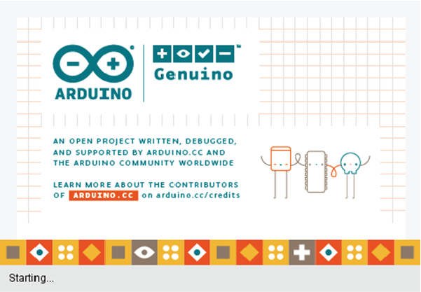
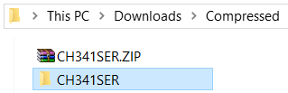

# Arduino IDE Software 💻

## Apa itu _Software_ ❔

Istilah _Software_ terdiri dari dua kata yang berasal dari bahasa Inggris, yakni _Soft_ dan _Ware_. Dalam bahasa Indonesia, _Soft_ berarti "Lunak" dan _Ware_ berarti "Perangkat". Jika digabungkan keduanya, akan memiliki arti dalam bahasa Indonesia yang berarti "Perangkat Lunak".

Kemudian muncul pertanyaan baru lagi, apa itu perangkat lunak?

Jika _Hardware_ atau Perangkat Keras, merupakan suatu komponen atau perangkat yang bisa kita sentuh dan kita rasakan di dunia nyata, maka _Software_ atau Perangkat Lunak sebaliknya.

Perangkat lunak merupakan sebuah perangkat kerja yang bisa kita gunakan dan beroperasi hanya dan hanya dalam laptop atau komputer. Contohnya, Browser yang teman-teman pakai saat ini untuk membaca **Dokumentasi** ini merupakan _software_ atau perangkat lunak. Microsoft Word juga termasuk _software_ yang kita gunakan untuk mengolah kata atau membuat dokumen dalam laptop atau komputer kita.

Setelah mengetahui arti _Software_ atau "Perangkat Lunak", jika kita tambahkan nama Arduino IDE setelah kata _Software_ atau "Perangkat Lunak", menjadi _Software_ Arduino IDE atau Perangkat Lunak Arduino IDE, maka berarti kita sedang membahas perangkat lunak milik Arduino, yaitu Arduino IDE.

## Apa itu _Software_ Arduino IDE ❔

Arduino IDE adalah suatu software yang dijalankan pada komputer/laptop yang akan kita gunakan untuk memprogram board mikrokontroller Arduino. Arduino IDE menggunakan bahasa pemrograman C++ yang disederhanakan sehingga dapat dipelajari dengan mudah oleh pemula.

Pada dasarnya, Arduino IDE seperti program untuk menerjemahkan perintah dari bahasa manusia ke bahasa mesin. Sehingga robot dapat memahami dan menjalankan perintah yang diberikan oleh manusia.

Contoh program yang ditulis dalam Arduino IDE ditunjukkan pada gambar di bawah ini.

Ada aturan-aturan yang harus ditaati ketika menulis perintah yang ingin dilakukan oleh robot menggunakan Arduino IDE. Selain itu kita perlu memahami fitur-fitur dari Arduino IDE. Aturan dan fitur-fitur Arduino IDE tersebut akan diulas dalam silabus ini.

Namun sebelumnya kita harus menginstall terlebih dahulu software Arduino IDE ke laptop/komputer kita.

## Instalasi Arduino IDE

Langkah-langkah meng-install software Arduino IDE akan dijabarkan pada langkah-langkah berikut ini:

### Mendownload Arduino IDE

1. Buka tautan berikut ini melalui browser favorit teman-teman: https://www.arduino.cc/en/software

2. Klik “Windows ZIP File” seperti yang ditandai pada gambar di bawah ini.

Note: Ketika tutorial ini dibuat, Arduino IDE masih dalam versi 1.8.19 seperti ditunjukkan oleh gambar di atas. Teman-teman mungkin akan mendapatkan versi Arduino IDE yang berbeda dan lebih tinggi dibandingkan tutorial ini, dan itu tak masalah.

3. Kemudian akan muncul halaman baru seperti gambar berikut ini.

Teman-teman diberikan dua pilihan, “Just Download” serta “Contribute & Download”. Jika ingin berkontribusi dengan memberikan dukungan finansial kepada Arduino sekaligus men-download Arduino IDE, Anda dapat meng-klik tombol “Contribute & Download”.

Namun jika teman-teman belum bisa memberikan donasi namun tetap ingin men-download Arduino IDE, Anda dapat meng-klik tombol “Just Download”.

### Mengekstrak File Zip

4. Setelah proses download selesai, maka akan mendapatkan file ZIP seperti pada gambar berikut:

5. Klik kanan pada file tersebut, dan pilih “Extract Here”

6. Akan muncul jendela ekstraksi seperti pada gambar di bawah ini. Tunggu hingga proses ekstraksi selesai dijalankan.

7. Setelah proses ekstraksi selesai, maka akan muncul folder baru seperti pada gambar di bawah. Double klik (klik dua kali) pada folder baru tersebut.

8. Setelah diklik dua kali, teman-teman akan menemukan banyak file seperti pada gambar di bawah. Kemudian klik tombol kiri mouse sekali saja pada file “arduino.exe” sebagaimana ditunjukkan pada gambar di bawah.

9. Setelah klik sekali, selanjutnya klik tombol kanan mouse sekali. Teman-teman akan melihat jendela pop-up pilihan baru muncul. Klik pada pilihan 'Pin to taskbar' seperti yang ditunjuk oleh tanda panah hitam pada gambar di bawah.

### Ikon Arduino IDE

10. Teman-teman akan menemukan ada ikon baru pada taskbar teman-teman seperti yang ditunjukkan oleh tanda panah hitam pada gambar di bawah.

 Ikon tersebut adalah logo Arduino IDE. Teman-teman bisa membuka Arduino IDE lewat logo ini nantinya. 

11. Selanjutnya klik logo tersebut sekali. Kemudian tunggulah beberapa saat sampai teman-teman melihat gambar opening Arduino IDE dengan tulisan "Starting..." seperti di bawah ini.

12. Jika muncul jendela baru seperti gambar di bawah, berarti proses instalasi Arduino IDE sudah berhasil. Selanjutnya lanjutkan langkah berikutnya.

## Instalasi Driver CH340

### Apa itu Driver CH340?

Karena Arduino bersifat Open Source alias semua informasi dari hardware hingga software nya dapat diperoleh dengan bebas, maka banyak yang memproduksi produk kloningan dari Arduino itu sendiri.

Gambar di atas menunjukkan salah satu produk Arduino, yakni Arduino Nano yang asli (gambar sebelah kiri) yang diproduksi oleh perusahan Arduino sendiri. Sementara gambar di sebelah kanan merupakan produk Arduino Nano tiruan yang diproduksi oleh perusahan lain.

Meski produk kloningan atau tiruan dari Arduino tersebut memiliki harga yang lebih murah serta dapat berfungsi sama seperti Arduino aslinya, namun ada beberapa produsen yang membutuhkan tambahan komponen sehingga Arduino kloning buatan mereka dapat terbaca di laptop/komputer kita. Komponen tambahan tersebut adalah chip CH340 yang terpasang di bagian bawah Arduino Nano seperti ditunjukkan oleh gambar di bawah.

Driver CH340 pada dasarnya merupakan konverter TTL (Transistor-Transistor Logic) ke USB dan sebaliknya. Logika TTL umum digunakan oleh mikrokontroller sedangkan USB umum kita temui pada perangkat seperti laptop/komputer. Agar mikrokontroller dapat berkomunikasi dengan laptop/komputer kita, kita perlu menerjemahkan logika TTL dari mikrokontroller agar dapat dibaca oleh laptop/komputer melalui USB.

### Mendownload Driver CH340

Berikut langkah-langkah mendownload dan menginstall Driver CH340

1. Bukalah browser favorit teman-teman pada laptop/komputer, dan buka alamat tautan berikut: http://www.wch-ic.com/downloads/CH341SER_ZIP.html

2. Pastikan bagian yang digarisbawahi oleh garis merah pada gambar di bawah tertulis CH341SER.ZIP untuk laptop/komputer yang menggunakan sistem operasi Windows. Jika sudah benar, klik tombol Download yang berwarna biru.

   Namun jika Anda pengguna sistem operasi Linux/Mac, klik pada file yang ditunjuk sesuai dengan jenis operasi yang Anda gunakan.

3. Setelah berhasil didownload, maka teman-teman akan mendapatkan file seperti pada gambar di bawah.

4. Ekstrak file tersebut dengan meng-klik kanan pada mouse dan pilih “Extract to CH341SER\”

5. Jika proses ekstraksi sudah selesai, maka akan didapatkan folder baru seperti pada gambar di bawah. Bukalah folder tersebut dengan cara mengklik tombol kiri mouse dua kali.

6. Setelah terbuka, teman-teman akan melihat banyak file. Kemudian double klik file bernama SETUP.EXE seperti ditunjukkan pada gambar di bawah.

7. Akan muncul window baru seperti pada gambar di bawah. Klik “Install”.

8. Setelah proses instalasi selesai, akan muncul window pemberitahuan yang menyatakan driver sukses di-Install seperti pada gambar di bawah. Kemudian klik OK.

9. Apabila semua proses Instalasi selesai, klik close pada window instalasi (tombol merah pada pojok kanan gambar di bawah). Instalasi Driver CH340 selesai.

## Fitur-Fitur Arduino IDE

Software Arduino IDE memiliki beberapa fitur utama yang perlu dipahami sebelum mulai lebih lanjut, rangkuman ini akan membantu memahami fitur-fitur Arduino IDE yang akan selalu digunakan dalam project bersama Robokarsa kedepannya.

:::info Sekadar Informasi

Sebelum lanjut membaca, RoboKarsa peringatkan terlebih dahulu ya, karena akan ada banyak sekali fitur-fitur Arduino IDE yang perlu diketahui oleh teman-teman.

Tapi jangan khawatir jika teman-teman belum menghafalnya. Dan teman-teman tidak harus menghafalnya sekarang juga. Karena nanti akan terhafal sendiri seiring perkembangan teman-teman belajar bersama RoboKarsa.

:::

 

### Menu Bar

Pada menu bar terdapat 5 menu yang berkaitan dengan proses kerja dalam Arduino IDE, yakni File, Edit, Sketch, Tools, dan Help. Kita akan menjabarkan fungsi tiap-tiap menu tersebut.

#### File Menu

Pada menu **File** terdapat submenu berikut:

Keterangan:

- **New** membuat sketch baru.
- **Open** membuka sketch yang telah disimpan.
- **Open Recent** membuka sketch yang terakhir dibuka sebelumnya.
- **Sketchbook** menampilkan semua daftar sketch yang pernah disimpan sebelumnya.
- **Examples** membuka contoh sketch yang telah disediakan oleh Arduino IDE.
- **Close** menutup sketch yang sedang dibuka saat ini.
- **Save** menyimpan sketch dengan format .ino standar.
- **Save As** menyimpan sketch dengan format yang diinginkan selain .ino.
- **Page Setup** mengatur ukuran serta orientasi kertas sebelum mencetak sketch dengan printer.
- **Print** memerintahkan agar printer mencetak sketch saat ini berdasarkan ukuran dan orientasi kertas yang telah diatur pada **Page Setup** sebelumnya.
- **Preferences** membuka jendela preferensi untuk mengatur beberapa hal dalam Arduino IDE seperti bahasa, lokasi penyimpanan sketch hingga menampilkan nomor baris kode.
- **Quit** keluar dari software Arduino IDE.

#### Edit Menu

Pada menu **Edit** terdapat submenu berikut:

- **Undo** membatalkan semua editan yang telah dilakukan sebelumnya.
- **Redo** lompat ke editan terakhir yang telah dilakukan,
- **Cut** menghapus teks yang dipilih dan memindahkannya ke clipboard.
- **Copy** menduplikasi teks yang dipilih dan memindahkan ke clipboard.
- **Copy for Forum** menduplikat teks yang dipilih sesuai dengan standar forum Arduino IDE.
- **Copy as HTML** menduplikat teks yang dipilih sesuai dengan standar HTML.
- **Paste** menempelkan teks yang telah di-Copy sebelumnya ke area yang diinginkan.
- **Select All** memblok semua teks yang ada pada sketch.
- **Go to line…** lompat ke nomor baris yang diinginkan.
- **Comment/Uncomment** menghilangkan atau menambahkan simbol komentar pada baris teks yang diinginkan.
- **Increase Indent** menambahkan ruang kosong panjang ke kanan pada baris program.
- **Decrease Indent** menghapus ruang kosong panjang ke kiri pada baris program.
- **Find…** mencari teks dalam sketch dengan kata kunci yang diinginkan.
- **Find Next** melanjutkan pencarian teks dalam teks dengan kata kunci yang diperintahkan.
- **Find Previous** kembali pada hasil pencarian teks sebelumnya dengan kata kunci yang diperintahkan.

#### Sketch Menu

Pada menu **Sketch** terdapat submenu berikut:

- **Verify/Compile** memerintahkan Arduino IDE untuk memeriksa apabila terdapat kesalahan pada sketch yang telah dibuat.
- **Upload** memerintahkan Arduino IDE untuk mengirimkan seluruh program pada sketch yang telah dibuat ke board mikrokontroller Arduino.
- **Upload Using Programmer** mengirim program pada sketch ke board mikrokontroller Arduino menggunakan programmer.
- **Export compiled Binary** memerintahkan Arduino IDE untuk menyimpan file .hex dari sketch yang telah dibuat.
- **Show Sketch Folder** menampilkan folder penyimpanan sketch yang sedang terbuka.
- **Include Library** menambahkan library pada sketch yang akan digunakan.
- **Add File…** menambahkan file sketch yang telah dibuat sebelumnya ke dalam file yang sedang terbuka.

#### Tools Menu

Pada menu **Tools** terdapat submenu berikut:

- **Auto Format** merapikan tata letak sketch.
- **Archive Sketch** menyimpan sketch dalam bentuk file .zip.
- **Fix Encoding & Reload** memperbaiki kemungkinan perbedaan antara pengkodean peta karakter editor pada Arduino IDE dan peta karakter pada sistem operasi lainnya.
- **Manage Libraries** mengelola pustaka (Library) seperti menghapus Library lama atau menginstall Library yang belum ada sebelumnya.
- **Serial Monitor** membuka jendela pertukaran data antara komputer dengan papan mikrokontroller Arduino yang sedang digunakan.
- **Serial Plotter** membuka jendela pertukaran data dalam bentuk grafik antara komputer dengan papan mikrokontroller Arduino yang sedang digunakan.
- **WiFi101 / WiFiNINA Firmware Updater** memeriksa apabila terdapat update terbaru pada firmware WiFi101.
- **Board** memilih jenis board mikrokontroller yang sedang digunakan.
- **Processor** memilih jenis chip yang tertanam pada board mikrokontroller yang sedang digunakan.
- **Get Board Info** mencari informasi board mikrokontroller yang sedang digunakan.
- **Programmer** menentukan jenis programmer yang akan digunakan untuk mengupload program sketch ke board mikrokontroller Arduino
- **Burn Bootloader** digunakan untuk menginstall bootloader Arduino IDE ke dalam chip ATMega yang belum terinstall bootloader Arduino IDE sebelumnya.

#### Help Menu

Pada menu **Help** terdapat submenu berikut:

- **Getting Started** membuka panduan resmi dari Arduino secara offline.
- **Environment** membuka penjelasan resmi dari Arduino mengenai fitur-fitur dalam Arduino IDE.
- **Troubleshooting** membuka opsi pemecahan masalah dengan penjelasan resmi dari Arduino IDE.
- **Reference** membuka referensi penulisan program.
- **Find In Reference** mencari referensi penulisan program dengan kata kunci yang diinginkan.
- **Frequently Asked Questions** membuka tanya jawab seputar pertanyaan yang umum ditanyakan.
- **Visit Arduino.cc** membuka situs resmi Arduino.
- **About Arduino** membuka informasi singkat mengenai Arduino dalam bentuk jendela pop-up.

 

### Tool Bar

Pada dasarnya menu Toolbar merupakan shortcut atau jalan pintas dari submenu yang tersedia pada Menu utama yang telah diterangkan sebelumnya. Menu-menu berikut ini merupakan yang paling sering digunakan dalam Arduino IDE sehingga dibuatkan jalan pintasnya pada menu Toolbar.

|                         Ikon                          | Nama Tools | Fungsi                                                                                                                                |
| :---------------------------------------------------: | :--------: | ------------------------------------------------------------------------------------------------------------------------------------- |
|  | **Verify** | Memverifikasi kode program yang telah dibuat untuk memeriksa kesalahan yang mungkin terjadi.                                          |
|  | **Upload** | Memverifikasi kode program telah dibuat serta upload ke board mikrokontroller Arduino apabila tidak terdapat error pada kode program. |
|     |  **New**   | Membuat sketch kosong untuk menulis program baru.                                                                                     |
|    |  **Open**  | Membuka file sketch yang telah disimpan sebelumnya.                                                                                   |
|    |  **Save**  | Menyimpan file sketch yang telah dibuat.                                                                                              |
|  | **Serial** | Monitor membuka jendela serial monitor.                                                                                               |

 

### Text Editor Area

Merupakan area kerja utama tempat kode program diketik dan dibuat. Disinilah kita akan membuat dan mengetik program yang ingin kita berikan kepada mikrokontroller. Ada aturan yang harus ditaati dalam menulis program seperti terlihat pada gambar di bawah ini terdapat beragam simbol dan huruf berwarna-warni. Kita akan mempelajari bagaimana memprogram pada tutorial selanjutnya nanti.

 

### Notification Bar

Area notifikasi menunjukkan status proses yang sedang terjadi seperti “**Compiling Sketch…**” yang berarti Arduino IDE sedang mengkompilasi dan memverifikasi sketch kode program.

Dan di sebelah kanan terdapat Progress Bar untuk menunjukkan sudah sampai mana proses kompilasi berjalan. Apabila Progress Bar sudah sepenuhnya berwarna hijau, menunjukkan bahwa proses kompilasi sudah selesai.

Apabila proses kompilasi sudah selesai, akan ditunjukkan oleh pesan **Done Compiling** seperti pada ditunjukkan oleh gambar di bawah.

Sedangkan apabila terdapat warna orange seperti pada gambar di bawah ini, menunjukkan terdapat error atau kesalahan dalam sketch kode program sehingga program gagal terkompilasi.

Dan kabar baiknya juga, Arduino IDE bisa memberitahu dimana letak error pada program kita melalui pesan pada Console Log area, yang akan kita bahas lebih lanjut berikutnya.

 

### Console Log

Konsol riwayat menunjukkan informasi hasil kompilasi serta informasi kerusakan yang mungkin terjadi selama proses kompilasi. Konsol Riwayat ditunjukkan oleh area kotak yang berwarna hitam seperti pada gambar di bawah.

Konsol riwayat juga menunjukkan ukuran sketch yang dibuat seperti ditunjukkan oleh teks berwarna putih pada gambar di atas yang menunjukkan sketch yang berhasil dikompilasi memiliki ukuran sebesar 444 bytes yang ditandai dengan pesan `Sketch uses 444 bytes (1%) of program storage space` atau menghabiskan 1% dari kapasitas penyimpanan memori yang ada pada Arduino Nano.

Sedangkan apabila terdapat teks berwarna orange seperti pada gambar di atas, menunjukkan posisi/letak kesalahan pada program. Sehingga mempermudah kita untuk mengetahui letak kesalahan pada program. Kita akan belajar bagaimana memahami pesan error pada console log seiring proses kita belajar di RoboKarsa. Jadi, tak perlu takut salah dan gagal jika belajar bersama RoboKarsa ya.

 

### Information Bar

Area Information Bar menunjukkan nomor baris dimana kursor berada saat ini (ditandai oleh tanda panah merah di sebelah kiri) serta informasi board yang meliputi jenis board hingga nomor Port USB yang sedang dipakai (ditandai oleh tanda panah merah di sebelah kanan).

Pada gambar di atas menunjukkan bahwa kursor sedang berada di baris nomor 4 dan jenis board mikrokontroller yang digunakan adalah Arduino Nano dengan chip ATmega328P dan menggunakan Old Bootloader untuk mengirim program yang ditulis dari komputer ke chip. Sedangkan nomor port COM USB yang sedang dipakai adalah COM31. Nomor port yang didapat akan berbeda-beda untuk tiap laptop atau komputer yang kita miliki nantinya. Jadi tak perlu khawatir jika nomor port COM.

Tentunya masih banyak fitur-fitur dan fungsi Arduino IDE yang belum dibahas pada dokumentasi ini. Namun tentu saja kita akan mempelajarinya sambil praktik bersama di kelas RoboKarsa nantinya.
