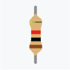
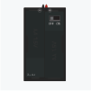
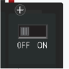
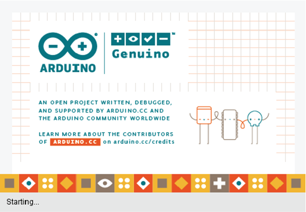

import Tabs from '@theme/Tabs';
import TabItem from '@theme/TabItem';
import tinkerCADsimsManualBlink from '/tinkercad-sims-manual-blink.mp4';

# Tutorial 1 - Blink ✨

## Apa itu Blink?

Tutorial pertama ini, bisa dibilang sangat mudah. Analoginya seperti kita belajar merebus air untuk pertama kalinya jika sedang belajar memasak, atau belajar merangkak bagi bayi sebelum bisa berlari kencang.

Pada tutorial ini kita akan belajar mengedipkan lampu LED yang ada pada Arduino Nano. Masih ingatkah yang mana lampu LED pada Arduino Nano? Teman-teman bisa melihatnya kembali pada topik **[Komponen-Komponen Arduino Nano ](/docs/tutorial-arduino/arduino-hardware.md#komponen-komponen-arduino-nano)**.

Atau bisa lihat kembali komponen bernomor 3 yang ditunjuk pada pada gambar di bawah ini

<div width="100%" style={{textAlign: 'center'}}>


</div>

Itulah komponen yang akan menjadi fokus kita pada Tutorial pertama kali ini. Kita akan mencoba menyalakan dan mematikan lampu LED tersebut dengan menulis program sederhana pada Arduino.

Oh iya, hampir lupa menjelaskan apa itu Blink sesuai pertanyaan. Blink berasal dari kata bahasa Inggris yang artinya "Kedip". Mengapa disebut Kedip?

Karena kita akan membuat lampu LED yang kita sebutkan tadi "Blinking" alias "Berkedip" yaitu akan menyala selama satu detik, kemudian padam selama satu detik, kemudian menyala kembali selama satu detik. Dan begitu seterusnya hingga dalam waktu yang kita lama.

## Simulasi Blink Virtual

Sebelumnya, mari kita berkenalan dahulu dengan elektronika dasar. Teman-teman tidak perlu paham sepenuhnya dengan elektronika saat ini, namun diharapkan teman-teman bisa menangkap konsepnya terlebih dahulu.

Di bawah ini ada video yang merupakan simulasi untuk menyalakan dan mematikan lampu secara manual. Dalam video simulasi terdapat tiga buah komponen virtual.

|                 Gambar Komponen                  | Nama Komponen | Fungsi                                                                                                                                                                                                                                                                                                                                                                |
| :----------------------------------------------: | :-----------: | --------------------------------------------------------------------------------------------------------------------------------------------------------------------------------------------------------------------------------------------------------------------------------------------------------------------------------------------------------------------- |
|             |    **LED**    | Merupakan singkatan dari Light Emitting Diode (Light=Cahaya, Emitting=Memancarkan, Diode=Dioda) yaitu dioda yang memancarkan cahaya. Komponen elektronika inilah yang menjadi lampu LED.                                                                                                                                                                              |
|        | **Resistor**  | Merupakan komponen elektronik yang berfungsi untuk menghambat arus yang akan mengalir ke lampu LED.                                                                                                                                                                                                                                                                   |
|      |  **Baterai**  | Sumber tegangan untuk menyalakan lampu LED.                                                                                                                                                                                                                                                                                                                           |
|  |  **Saklar**   | Komponen elektronik yang berfungsi untuk memutus atau mengalirkan tegangan. OFF berarti Padam, yaitu kondisi dimana tegangan dari baterai tidak mengalir ke lampu LED. Sedangkan ON berarti Menyala, yaitu kondisi dimana tegangan dari baterai mengalir ke lampu LED sehingga lampu LED dapat menyala. Pada gambar di samping, posisi saklar berada pada posisi OFF. |

Setelah teman-teman mengetahui nama komponen virtual, mari kita lihat video berikut dan apa yang terjadi jika kita menekan mengubah posisi saklar dari OFF ke ON dan sebaliknya dari ON ke OFF.

<div style={{textAlign: 'center'}}>

<video width="70%" controls>
  <source src={tinkerCADsimsManualBlink}/>
</video>

</div>

Teman-teman bisa lihat bukan? Bahwa lampu LED yang berwarna merah akan menyala jika saklar berada pada posisi ON dan lampu LED akan padam jika saklar berada pada posisi OFF.

Kemudian kita nyalakan dan matikan lampu tersebut berkali-kali, sehingga lampu LED berwarna merah tersebut sedang 'Blinking' alias 'Berkedip'.

Nah, selanjutnya, kita akan melakukan hal yang sama pada lampu LED pada Arduino Nano yang kita bahas sebelumnya tadi.

Yakni kita akan membuat lampu LED pada Arduino Nano 'Blinking' atau 'Berkedip' secara otomatis.

Bagaimana caranya?

Mari kita simak langkah-langkah berikut ya, teman-teman.

<br/>

## Mulai Beraksi 🚀

Baik, sebelum mulai beraksi, pastikan teman-teman sudah membaca Prasyarat, Target Pelajaran, dan Komponen Yang Dibutuhkan ya.

Klik pada salah satu dari ketiga tombol di bawah ini untuk membuka Prasyarat, Target Pelajaran dan Komponen Yang Dibutuhkan.

<Tabs className="unique-tabs">
<TabItem value="Prasyarat 🔑">

- Sudah meng-**[Install Arduino IDE](/docs/tutorial-arduino/arduino-ide-software.md#instalasi-arduino-ide)**
- Sudah meng-**[Install Driver CH340](/docs/tutorial-arduino/arduino-ide-software.md#instalasi-driver-ch340)**
- Sudah mempelajari **[Modul Board Arduino Nano](/docs/tutorial-arduino/arduino-hardware.md)**

Kalau teman-teman merasa belum memenuhi prasyarat yang dibutuhkan, diharapkan untuk membaca dan memenuhinya terlebih dahulu.

</TabItem>

<TabItem value="Target Pelajaran 🎯">

- Mengenali konsep dasar elektronika
- Mengenali antarmuka Arduino IDE
- Mengetahui bagaimana mengupload sketch dari Arduino Nano ke Arduino Nano
- Mengenali perintah-perintah dasar sketch program Arduino IDE
- Mengenali fisik Arduino Nano

</TabItem>

<TabItem value="Komponen Yang Dibutuhkan 🛠">

- 1 x Arduino Nano
- 1 x Kabel USB Arduino Nano
- 1 x Komputer/Laptop

</TabItem>
</Tabs>

:::caution Perhatian

Penting untuk memperhatikan setiap langkah-langkah yang diberikan dan tidak melakukan apapun diluar perintah langkah yang diberikan.

Kenapa? Hal ini untuk mencegah kerusakan yang tidak diinginkan pada komponen apabila bertindak di luar langkah pelajaran yang diberikan dan tidak mengetahui dengan pasti apa yang teman-teman lakukan.

:::

### Menyiapkan Arduino Nano

1. Siapkan kabel USB Arduino Nano dan Arduino Nano seperti pada gambar di bawah.

<p align="center" width="100%">

&nbsp; &nbsp; &nbsp;

</p>

2. Tancapkan ujung Kabel USB Arduino Nano yang ditandai oleh kotak merah pada lubang port USB Arduino Nano yang ditandai oleh kotak kuning.

<p align="center" width="100%">
    
&nbsp; &nbsp; &nbsp;
 
</p>

<p align="center"> Maka hasilnya akan seperti ditunjukkan oleh gambar di bawah. </p>

<p align="center" width="100%">

</p>

3. Hubungkan ujung kabel lainnya pada Port USB Laptop/Komputer seperti pada gambar di bawah. Letak posisi lubang port USB laptop kita mungkin berbeda dengan yang ditunjukkan pada gambar di bawah.

<p align="center" width="100%">


</p>

### Membuka Arduino IDE

4. Selanjutnya kita akan membuat sketch program baru di Arduino IDE. Bukalah Arduino IDE pada laptop/komputer Anda. Dengan meng-klik sekali pada ikon Arduino IDE. Jika teman-teman lupa bagaimana cara membuka Arduino IDE, kita sarankan teman-teman untuk melihat kembali di **[Ikon Arduino IDE](/docs/tutorial-arduino/arduino-ide-software.md#ikon-arduino-ide)**.

<p align="center" width="100%">


</p>

5. Tunggulah beberapa saat sampai teman-teman melihat gambar opening Arduino IDE dengan tulisan "Starting..." seperti di bawah ini.

<div width="100%" style={{textAlign: 'center'}}>



</div>

6. Jika telah terbuka, buatlah sketch baru dengan cara mengklik **File→New** atau dengan cara mengklik tombol `CTRL` dan `N` pada keyboard secara bersamaan.

<p align="center" width="100%">


</p>

<p align="center"> Maka akan muncul window baru yang tampak kosong seperti pada gambar di bawah.
 </p>

<p align="center" width="100%">


</p>

### Membuat Sketch Baru

7. Jika teman-teman perhatikan, terdapat nama **sketch_mar23**, seperti yang digarisbawahi oleh garis merah pada gambar di bawah 👇.
   <p align="center" width="100%"> </p>

   Nama tersebut merupakan nama yang muncul jika kita pertama kali membuat sketch baru di Arduino IDE. "mar23" pada nama **sketch_mar23** merupakan informasi waktu kapan sketch tersebut dibuat, yakni pada tanggal 23 Maret.

   Sehingga nama sketch yang muncul di laptop atau komputer teman-teman berbeda dengan gambar di di atas, yang mana itu tidak masalah.

   Jika teman-teman penasaran juga dengan nama **Arduino 1.18.13** yang digarisbawahi oleh garis kuning, nama tersebut sebenarnya nomor versi Arduino IDE yang sedang kita gunakan saat ini. Ketika Dokumentasi ini ditulis, RoboKarsa masih menggunakan Arduino IDE versi 1.18.13. Sehingga nomor versi yang teman-teman dapati mungkin berbeda dengan gambar di atas 👆 tadi, yang mana itu tidak masalah juga.

### Menyimpan Sketch Baru

8. Selanjutnya, tentu saja kita tidak ingin menyimpan nama sketch program kita tadi dengan nama aneh seperti **sketch_mar23** tadi. Kita harus menyimpannya dengan nama yang kita buat sendiri agar mudah ketika mencari file nya kembali.

   Caranya dengan menekan tombol `CTRL` dan `S` pada keyboard secara bersamaan. Maka akan muncul window baru seperti pada gambar di bawah.

   Klik ikon "Create New Folder" seperti ditunjukkan oleh tanda panah hitam dalam gambar di bawah.

<p align="center" width="100%">


</p>

9. Setelah itu, teman-teman akan mendapati folder baru dengan nama "New Folder" seperti pada gambar di bawah. Selanjutnya, kita akan mengubah nama **New Folder** tersebut menjadi **Program Tutorials**. Caranya dengan klik tombol kanan mouse pada ikon folder tersebut. Akan muncul jendela pilihan pop-up seperti pada gambar di bawah ini.

<p align="center" width="100%">


</p>

10. Pilih opsi "Rename" seperti yang ditunjuk oleh tanda panah hitam pada gambar di atas. Setelah meng-klik opsi "Rename", teman-teman akan mendapati kalau nama folder "New Folder" tadi berubah menjadi warna biru seperti pada gambar di bawah ini.

<p align="center" width="100%">


</p>

11. Selagi nama folder "New Folder" tersebut berwarna biru, ketik PROGRAM TUTORIALS sehingga nama foldernya akan menjadi seperti pada gambar di bawah ini. Tekan tombol `Enter` pada keyboard teman-teman jika telah selesai mengetik.

<p align="center" width="100%">


</p>

12. Hore,, setelah teman-teman menekan tombol `Enter`, teman-teman akan mendapati folder baru yang telah teman-teman buat dengan nama PROGRAM TUTORIALS seperti pada gambar di bawah ini.

<p align="center" width="100%">


</p>

13. Selanjutnya kita akan membuka folder tersebut. Bagaimana caranya? Teman-teman cukup mengklik tombol kiri mouse dua kali pada folder tersebut. Kemudian tampilannya akan berubah seperti pada gambar di bawah ini. Teman-teman bisa perhatikan kalau dalam folder tersebut akan ada tulisan "No items match to your search". Hal ini menandakan bahwa foldernya masih kosong.

<p align="center" width="100%">


</p>

14. Selanjutnya kita akan mengetik nama sketch kita pada area "File name". Caranya dengan mengklik sekali area kotak putih seperti yang ditandai oleh tanda panah hitam pada gambar di bawah.

<p align="center" width="100%">


</p>

15. Kemudian ketik **TUTORIAL_1_BLINK** sebagai File Name seperti yang ditunjukk oleh panah hitam pada gambar di atas. Setelah selesai mengetik nama file, klik tombol `Save` seperti yang ditunjuk oleh panah hitam sebelah kanan pada gambar di bawah.

<p align="center" width="100%">


</p>

16. Setelah mengklik tombol `Save`, sketch baru telah tersimpan, dan nama file pada sketch (ditandai oleh kotak biru seperti pada gambar di bawah) akan berubah dengan nama file yang telah dimasukkan sebelumnya dan notification bar akan memberikan informasi “Done Saving” yang berarti “Selesai Menyimpan”.

<p align="center" width="100%">


</p>

:::info Sekadar Informasi

Arduino IDE akan mengganti karakter spasi dengan tanda garis bawah ( \_ ) untuk memisahkan tiap kata. Sebagai contoh, apabila kita ingin memberi nama sebagai `TUTORIAL 1 BLINK`, maka kita harus mengetiknya seperti berikut `TUTORIAL_1_BLINK`.

:::

### Mengetik Program

17. Sampai sini, teman-teman baru sepertiga jalan. Teman-teman sudah berhasil membuat sketch baru dan menyimpan sketch baru tersebut dengan nama sketch yang kita tentukan sendiri. Langkah selanjutnya, kita akan mulai mengetik program. Ketiklah program di bawah ini. Jangan khwatir jika belum tahu atau belum mengerti semua arti program tersebut. Karena di topik **Penjelasan Program** nanti, akan dijelaskan secara detail.

<!-- <pre>
<code>
<font color="#434f54">&#47;&#47; the setup function runs once when you press reset or power the board</font>
<br/>
<font color="#00979c">void</font> <font color="#5e6d03">setup</font><font color="#000000">(</font><font color="#000000">)</font> <font color="#000000">&#123;</font>
&nbsp;<font color="#434f54">&#47;&#47; initialize digital pin LED_BUILTIN as an output.</font>
<br/>
&nbsp;<font color="#d35400">pinMode</font><font color="#000000">(</font><font color="#00979c">LED_BUILTIN</font><font color="#434f54">,</font> <font color="#00979c">OUTPUT</font><font color="#000000">)</font><font color="#000000">;</font>
<font color="#000000">&#125;</font>
<br/>
<br/>
<font color="#434f54">&#47;&#47; the loop function runs over and over again forever</font>
<br/>
<font color="#00979c">void</font> <font color="#5e6d03">loop</font><font color="#000000">(</font><font color="#000000">)</font> <font color="#000000">&#123;</font>
<br/>
&nbsp;<font color="#d35400">digitalWrite</font><font color="#000000">(</font><font color="#00979c">LED_BUILTIN</font><font color="#434f54">,</font> <font color="#00979c">HIGH</font><font color="#000000">)</font><font color="#000000">;</font> &nbsp;&nbsp;<font color="#434f54">&#47;&#47; turn the LED on (HIGH is the voltage level)</font>
<br/>
&nbsp;<font color="#d35400">delay</font><font color="#000000">(</font><font color="#000000">1000</font><font color="#000000">)</font><font color="#000000">;</font>
&nbsp;&nbsp;&nbsp;&nbsp;&nbsp;&nbsp;&nbsp;&nbsp;&nbsp;&nbsp;&nbsp;&nbsp;&nbsp;&nbsp;&nbsp;&nbsp;&nbsp;&nbsp;&nbsp;&nbsp;&nbsp;&nbsp;<font color="#434f54">&#47;&#47; wait for a second</font>
<br/>
&nbsp;<font color="#d35400">digitalWrite</font><font color="#000000">(</font><font color="#00979c">LED_BUILTIN</font><font color="#434f54">,</font> <font color="#00979c">LOW</font><font color="#000000">)</font><font color="#000000">;</font> &nbsp;&nbsp;&nbsp;<font color="#434f54">&#47;&#47; turn the LED off by making the voltage LOW</font>
<br/>
&nbsp;<font color="#d35400">delay</font><font color="#000000">(</font><font color="#000000">1000</font><font color="#000000">)</font><font color="#000000">;</font> &nbsp;&nbsp;&nbsp;&nbsp;&nbsp;&nbsp;&nbsp;&nbsp;&nbsp;&nbsp;&nbsp;&nbsp;&nbsp;&nbsp;&nbsp;&nbsp;&nbsp;&nbsp;&nbsp;&nbsp;&nbsp;&nbsp;<font color="#434f54">&#47;&#47; wait for a second</font>
<br/>
<font color="#000000">&#125;</font>
</code>
</pre> -->

```arduino title="TUTORIAL_BLINK_1.ino" showLineNumbers
// the setup function runs once when you press reset or power the board
void setup() {
 // initialize digital pin LED_BUILTIN as an output.
 pinMode(LED_BUILTIN, OUTPUT);
}

// the loop function runs over and over again forever
void loop() {
 digitalWrite(LED_BUILTIN, HIGH);   // turn the LED on (HIGH is the voltage level)
 delay(1000);                      // wait for a second
 digitalWrite(LED_BUILTIN, LOW);    // turn the LED off by making the voltage LOW
 delay(1000);                       // wait for a second
}
```

:::tip Tips

Meskipun teman-teman bisa langsung copy-paste program di atas, RoboKarsa menyarankan teman-teman untuk mengetiknya secara manual agar melatih Muscle Memory (Memori Otot) tangan teman-teman sehingga menjadi terbiasa mengetik dengan 10 jari.

:::

### Memverifikasi Program

18. Jika teman-teman sudah selesai mengetik program, mari kita periksa apakah program yang sudah teman-teman ketik sama persis dengan program yang disediakan di atas. Kita akan meng-verify programnya.

    "Verify" berasal dari kata bahasa Inggris yang artinya adalah memverifikasi atau memvalidasi dalam bahasa Indonesia. Bagaimana cara kita memverifikasinya? Caranya adalah dengan meng-klik tombol Verify yang terdapat di Arduino IDE seperti yang ditunjukkan oleh ikon di samping 👉 . Bisakah teman-teman menemukan tombol tersebut di Arduino IDE? Jika sudah menemukannya, tekanlah tombol tersebut.

19. Jika proses verify selesai dan information bar (ditunjukkan oleh kotak biru) menunjukkan “Done compiling”, maka program sudah benar. Periksa kembali ketikan sketch program. Pastikan agar ketikan sketch program sama persis seperti diminta agar tidak mengalami error saat compiling.

<p align="center" width="100%">


</p>

:::info Sekadar Informasi

Patut diingat, Arduino IDE bersifat case-sensitive, alias sangat memperhatikan huruf besar dan huruf kecil pada programnya. Sebagai contoh, <font color="#d35400">`pinMode`</font> berbeda dengan <font color="#d35400">`pinmode`</font> karena perbedaannya terletak pada besar kecilnya huruf <font color="#d35400">`m`</font> dan <font color="#d35400">`M`</font>.

Huruf <font color="#d35400">`m`</font> merupakan huruf kecil. Sedangkan Huruf <font color="#d35400">`M`</font> merupakan huruf besar. Maka <font color="#d35400">`pinMode`</font> dan <font color="#d35400">`pinmode`</font> dianggap berbeda

Oleh karenanya penting untuk mengetik program tersebut persis sesuai yang diberikan dan memperhatikan besar kecilnya huruf.

:::

### Mengkonfigurasi Arduino IDE

20. Memilih Jenis Board

Pastikan jenis board yang digunakan sudah sesuai dengan settingan pada Arduino IDE dengan cara memilih opsi berikut secara berurutan Tools ➜ Board ➜ Arduino Nano atau perhatikan urutan tanda panah pada gambar di bawah ini. Disini kita memilih Arduino Nano karena kita menggunakan Arduino Nano.

<p align="center" width="100%">


</p>

21. Memilih Jenis Processor

Processor dalam bahasa Indonesia berarti Prosessor, atau Pemroses sebuah perintah, singkatnya seperti otak dari robot. Disini kita akan menentukan jenis Processor yang digunakan oleh Arduiino Nano, yaitu ATMega328P (Old Bootloader), dengan cara memilih opsi berikut secara berurutan Tools ➜ Processor ➜ ATmega328P (Old Bootloader). Atau ikuti urutan tanda panah pada gambar di bawah ini

<p align="center" width="100%">


</p>

22. Memilih Nomor Port

Nomor port untuk Arduino Nano pada tiap laptop/komputer dapat berbeda-beda. Pilihlah nomor port yang muncul pada pilihan yang tersedia di Arduino IDE. Lebih jelasnya, perhatikan gambar di bawah.

<p align="center" width="100%">


</p>

### Mengupload Program

Setelah proses verifikasi teman-teman sudah berhasil dan konfigurasi Arduino IDE sudah selesai, saatnya kita mengupload program. Mengupload Program sama seperti kita menulis sebuah surat lalu mengantarkan surat tersebut kepada orang lain. Ketika kita sudah selesai menulis atau mengetik program, kita mengantarkan program tersebut ke Arduino Nano. Proses mengantarkan program tersebut disebut sebagai "Upload".

23. Setelah proses konfigurasi selesai seperti yang diperintahkan, lanjutkan dengan mengklik tombol upload  pada Arduino IDE.

<p align="center" width="100%">


</p>

24. Tunggulah beberapa saat hingga information bar tertulis "Done Uploading" seperti ditunjukkan oleh tanda panah merah seperti pada gambar di bawah.

<p align="center" width="100%">


</p>

Jika proses upload berhasil, perhatikan lampu LED pada Arduino Nano seperti pada gambar di bawah. Lampu LED tersebut seharusnya akan berkedip setiap 1 detik sesuai yang diperintahkan oleh program yang telah ditulis.

<p align="center" width="100%">


</p>

Selanjutnya kita akan masuk ke bagian Penjelasan Program

<br/>

## Penjelasan Program 📝

Pada bagian ini, kita akan menjelaskan setiap bagian dari kode-kode yang sudah teman-teman tulis sebelumnya. Kita harap penjelasan yang kita sajikan bisa dipahami dan ditangkap dengan mudah oleh teman-teman. Karena di akhir Tutorial 1 nanti, akan ada tantangan yang bisa mengasah kemampuan teman-teman nantinya.

Tanpa perlu berlama-lama lagi, mari kita langsung mulai penjelasannya saja.

### Bagian utama program Arduino

Pada dasarnya, semua sketch program yang ditulis untuk mengontrol perangkat Arduino memiliki dua buah fungsi program utama yakni <font color="#00979c">`setup`</font><font color="#000000">`(`</font><font color="#000000">`)`</font> dan <font color="#00979c">`loop`</font><font color="#000000">`(`</font><font color="#000000">`)`</font> seperti ditunjukkan oleh contoh sketch program kosong di bawah.

```arduino title="Program Kosong" showLineNumbers
void setup()
{

//Halo, aku adalah kode milik fungsi setup() karena berada di antara tanda { dan tanda }

}


void loop()
{

//Halo, aku adalah kode milik fungsi loop() karena berada di antara tanda { dan tanda }

}
```

:::info Sekadar Informasi
Bisakah teman-teman lihat angka-angka 1, 2, 3 , 4, 5, 6 dan seterusnya hingga 13 pada sisi kiri program di atas? Angka-angka tersebut disebut sebagai nomor baris. Yaitu nomor yang menunjukkan di baris berapa kode tersebut di tulis. Misalnya kode `void loop()` ditulis pada baris nomor 1 dan kode `void setup()` ditulis pada baris nomor 9.
:::

Fungsi `setup()` dimulai dengan tanda kurawal buka ( `{` ) pada baris nomor 2 dan diakhiri dengan tanda kurawal tutup ( `}` ) pada baris nomor 5. Semua kode yang berada di antara tanda kurawal buka dan tanda kurawal tutup akan disebut sebagai bagian dari fungsi `setup()` pada program di atas.

Begitu pula dengan fungsi `loop()` dimulai dengan kurawal buka ( `{` ) pada baris nomor 10 dan diakhiri dengan tanda kurawal tutup ( `}` ) pada baris nomor 14. Semua kode yang berada di antara tanda kurawal buka dan tanda kurawal tutup akan disebut sebagai bagian dari fungsi `loop()` pada program di atas.

Sebagai contoh pada program yang kita gunakan di bawah, `pinMode(LED_BUILTIN, OUTPUT)` merupakan statemen/perintah/kode yang berada di dalam fungsi `setup()` karena terletak di antara tanda kurawal buka ( `{` ) pada baris nomor 2 dan tanda kurawal tutup ( `}` ) pada baris 5.

```arduino title="TUTORIAL_BLINK_1.ino" showLineNumbers
// the setup function runs once when you press reset or power the board
void setup() {
 // initialize digital pin LED_BUILTIN as an output.
 pinMode(LED_BUILTIN, OUTPUT);
}
```

Pada fungsi `setup()`, semua program yang berada dalam fungsi tersebut akan dijalankan hanya sekali saja setelah proses upload ke board Arduino Nano berhasil. Umumnya bagian `setup()` berisi perintah-perintah inisialisasi awal seperti mengatur fungsi pin, kecepatan baudrate, dan sebagainya yang hanya perlu dijalankan sekali saja. Kita akan tahu lebih dalam mengenai fungsi `setup()` ini nanti pada Tantangan 2 di bawah.

Kemudian untuk fungsi `loop()`, sama halnya seperti fungsi `setup()`, fungsi `loop()` dimulai dengan kurawal buka ( `{` ) dan diakhiri dengan tanda kurawal tutup ( `}` ). Semua program yang berada di antara tanda kurawal buka dan tanda kurawal tutup akan disebut sebagai bagian dari fungsi `loop()`.

Sebagai contoh, pada potongan program di bawah ini, semua kode yang berada dalam baris 9 sampai 12 merupakan statemen/perintah/program yang berada di dalam fungsi `loop()` karena terletak di antara kurawal buka ( `{` ) pada baris nomor 8 dan kurawal tutup ( `}` ) pada baris 13.

```arduino title="TUTORIAL_BLINK_1.ino" showLineNumbers
// the setup function runs once when you press reset or power the board
void setup() {
 // initialize digital pin LED_BUILTIN as an output.
 pinMode(LED_BUILTIN, OUTPUT);
}

// the loop function runs over and over again forever
void loop() {
 digitalWrite(LED_BUILTIN, HIGH);   // turn the LED on (HIGH is the voltage level)
 delay(1000);                      // wait for a second
 digitalWrite(LED_BUILTIN, LOW);    // turn the LED off by making the voltage LOW
 delay(1000);                       // wait for a second
}
```

Jika fungsi `setup()` dijalankan sekali saja, pada fungsi `loop()`, semua program yang berada dalam bagian tersebut akan dijalankan berulang-ulang terus menerus selama Arduino Nano menyala dan diberi tegangan. Sekali lagi, kita akan melihat lebih jelas perbedaan antara fungsi `setup()` dan `loop()` nantinya pada Tantangan 2 di bawah.

### Bedah fungsi setup()

Mari kita membedah dan mencari tahu arti dari kode-kode yang kita tulis pada Tutorial 1 ini. Di bawah kita tampilkan kembali potongan kode yang sudah teman-teman ketik sebelumnya.

```arduino title="TUTORIAL_BLINK_1.ino" showLineNumbers
// the setup function runs once when you press reset or power the board
void setup() {
 // initialize digital pin LED_BUILTIN as an output.
 pinMode(LED_BUILTIN, OUTPUT);
}

// the loop function runs over and over again forever
void loop() {
 digitalWrite(LED_BUILTIN, HIGH);   // turn the LED on (HIGH is the voltage level)
 delay(1000);                      // wait for a second
 digitalWrite(LED_BUILTIN, LOW);    // turn the LED off by making the voltage LOW
 delay(1000);                       // wait for a second
}
```

Pada baris pertama atau baris nomor satu, program dimulai dengan baris komentar

<p align="center" width="100%">


</p>

yang memiliki arti “Fungsi setup dijalankan sekali ketika Kau menekan tombol reset atau menyalakan perangkat Arduino Nano" dalam bahasa Indonesia.

Baris komentar selalu dimulai dengan simbol `//`. Teman-teman bisa memberikan komentar apapun baik berbahasa Inggris maupun berbahasa Indonesia setelah simbol ini. Komentar tersebut bisa teman-teman gunakan seperti catatan agar tidak terlupa arti kode yang teman-teman tulis, misalnya untuk menunjukkan fungsi atau nomor pin yang digunakan. Seperti pada contoh berikut:

```arduino
 pinMode(LED_BUILTIN, OUTPUT); //Pin nomor 13 dijadikan sebagai OUTPUT
```

Perlu diingat, penggunaan simbol `//` sebagai komentar harus dibuat dalam satu baris. Semua komentar akan diabaikan oleh Arduino Nano dan tidak menganggapnya sebagai bagian dari program. Sehingga komentar dapat berguna bagi pemrogram sebagai catatan agar tidak terlupa fungsi dari program itu sendiri.

Selanjutnya, pada baris 2 hingga baris ke 5 berikutnya pada program terdapat fungsi `setup()` yang dimulai dengan kurawal buka `{` pada baris 2 dan diakhiri dengan tanda kurawal tutup `}` pada baris 5. Bisakah teman-teman menemukan tanda kurawal buka dan tanda kurawal tutupnya?

<p align="center" width="100%">


</p>

Di dalam fungsi `setup()` di atas terdapat dua baris kode yakni baris komentar pada baris ke 3, dan inisialisasi pin digital Arduino Nano nomor 13 sebagai OUTPUT.

Pada baris 3, terdapat komentar:

<p align="center" width="100%">


</p>

Yang memiliki arti “Inisialisasikan pin digital LED_BUILTIN sebagai sebuah keluaran” dalam bahasa Indonesia. Kira-kira apa maksudnya `LED_BUILTIN`?

Mari kita bedah lagi kata-katanya, pada kode `LED_BUILTIN`aslinya terdapat dua buah kata, yaitu LED dan BUILT-IN. LED berarti nama komponen lampu LED. dan BUILT-IN yang kurang lebih artinya dalam bahasa Indonesia adalah "Terpasang".

Jadi, jika kita terjemahkan arti LED BUILT-IN secara keseluruhan adalah "lampu LED yang terpasang pada Arduino Nano". Teman-teman masih ingat bukan, lampu LED yang terpasang pada Arduino Nano? Benar, itu adalah lampu LED yang berkedip ketika kita menjalankan program tadi. Dan lampu LED yang berkedip tadi terhubung dengan pin nomor 13 Arduino Nano.

Kemudian pada baris 4, terdapat kode:

<p align="center" width="100%">


</p>

Kode `pinMode()` merupakan sebuah fungsi yang akan sering kita gunakan. Fungsi pinMode() memiliki dua parameter, yaitu Nomor Pin, dan Peran Pin. Peran Pin disini maksudnya adalah nomor pin yang dimaksud akan berperan sebagai INPUT atau OUTPUT.

Perintah `pinMode()` memiliki dua buah parameter yakni Nomor Pin, dan Jenis Fungsi. Parameter tersebut ditulis dalam tanda kurung () dan secara sederhananya akan ditulis dengan syntax seperti `pinMode(Nomor Pin, Peran Pin)`.

Jika kita ingin pin nya berperan untuk menerima sinyal, kita harus menulis kodenya sebagai INPUT. Sedangkan jika kita ingin pin nya berperan untuk memberikan sinyal, kita harus menulis kodenya sebagai OUTPUT.

:::info Sekadar Informasi

Syntax adalah sebuah istilah untuk menyatakan aturan atau bagaimana suatu bahasa ditulis. Misalnya, ketika kita menulis dalam bahsa Indonesia atau bahasa Inggris, kita menulisnya dari kiri ke kanan, bukan? Kemudian ketika kita menulis dalam bahasa Arab, kita menulisnya dari kiri ke kanan.

:::

Pada baris nomor 4 di atas, dalam fungsi pinMode() terdapat kode `LED_BUILTIN` sebagai nomor pin, dan kode `OUTPUT` sebagai peran pin, yaitu memberikan sinyal keluaran.

Tunggu, bukankan nomor pin harusnya berupa angka, mengapa kode LED_BUILTIN yang merupakan sebuah kata atau huruf bisa dianggap sebagai nomor pin?

Disinilah serunya pemrograman. Kita bisa mengubah sebuah kata atau huruf dianggap sebagai angka oleh mesin. Teman-teman masih ingat penjelasan pada baris 3 di atas sebelumnya? Bahwa lampu LED yang berkedip terhubung dengan pin nomor 13 Arduino Nano.

Jadi, kode `LED_BUILTIN` bisa dianggap sebagai pin nomor 13 oleh Arduino Nano. Nanti kita akan belajar lebih dalam lagi tentang `pinMode()` ini pada Tantangan 1.

Sedangkan parameter Peran Pin yang digunakan adalah pada baris 4 di atas adalah `OUTPUT`. Hal ini dikarenakan kita akan menyalakan lampu LED pada Arduino Nano yang terhubung dengan pin nomor 13 Arduino Nano. Dengan kata lain kita akan memberikan sinyal berupa tegangan 5 Volt kepada lampu LED tersebut sehingga kita bisa menyalakan lampu LED tersebut.

<p align="center" width="100%">


</p>

Perhatikan bahwa terdapat tanda titik koma/semicolon `;` pada akhir baris. Jika dalam susunan bahasa manusia, tanda titik ( . ) digunakan sebagai tanda untuk mengakhiri sebuah baris kalimat, maka dalam susunan bahasa mesin, tanda titik koma/semicolon digunakan sebagai tanda untuk mengakhiri akhir baris suatu program.

Apabila terdapat program yang tidak memiliki tanda titik koma pada akhir barisnya, maka dapat dipastikan program tersebut akan mengalami error pada saat proses verify maupun upload.

Kemudian pada baris ke 5, terdapat tanda kurawal tutup `}` yang merupakan akhir dari fungsi `setup()`. Ingat kembali, program yang terdapat dalam fungsi `setup()` hanya akan dijalankan sekali saja begitu Arduino Nano menyala atau terhubung dengan laptop/komputer.

### Bedah fungsi loop()

Selanjutnya akan membahas bagian fungsi `loop()`.

<p align="center" width="100%">


</p>

Bagian fungsi `loop()` dibuka dengan komentar pada baris 7 yang memiliki arti “Fungsi loop berjalan terus menerus selamanya”.

<p align="center" width="100%">


</p>

Isi dari fungsi `loop()` dimulai dengan tanda kurawal buka `{` pada baris 8 dan diakhiri dengan kurawal tutup `}` pada baris 13. Bisakah teman-teman menemukan tanda kurawal buka dan kurawal tutup nya pada program di atas?

Isi utama dalam fungsi loop() adalah dua buah perintah yakni `digitalWrite()` dan `delay()`.

Pertama akan dibahas lebih dahulu perintah `digitalWrite()`. Sesuai arti pada namanya, Write yang berarti "menulis", yakni untuk "menulis" atau memberikan sinyal digital ke nomor pin yang dikehendaki baik itu sinyal `HIGH` ataupun sinyal `LOW`.

Perintah `digitalWrite()` memiliki dua buah parameter yakni Nomor Pin dan Kondisi Logika yang ditulis diantara tanda kurung . Sehingga syntax penulisannya adalah `digitalWrite(Nomor Pin, Kondisi Logika)`.

Parameter `Nomor Pin` harus diisi dengan nomor pin yang akan diberi logika. Sedangkan parameter `Kondisi Logika` harus diisi dengan jenis logika yang diinginkan. Parameter Kondisi Logika dapat berupa `HIGH`, `LOW`, `0` atau `1`.

Pada dunia elektronika, logika `HIGH` dan `1` berarti memberikan kondisi Hidup atau Menyala dengan memberikan sinyal berupa tegangan dengan nilai voltase tertentu. Pada Arduino Nano, tegangan dengan nilai sebesar 5 Volt dianggap sebagai logika `HIGH` atau `1` sehingga dapat menyalakan lampu LED apabila diberi logika `HIGH`.

Sedangkan pada logika LOW atau 0 akan memberikan kondisi Mati atau Tidak Menyala karena memberikan sinyal berupa tegangan 0 Volt. Sehingga akan memadamkan lampu LED apabila diberi logika `LOW`.

Pada baris 9 pada sketch di bawah memiliki parameter nomor pin `LED_BUILTIN` (atau boleh dianggap sebagai nomor `13`) dan parameter logika HIGH.

<p align="center" width="100%">


</p>

Dengan kata lain, baris 9 di atas memerintahkan untuk memberikan tegangan sebesar 5 Volt dengan menggunakan parameter logika HIGH pada pin nomor `LED_BUILTIN` (atau dapat dianggap sebagai nomor `13`) sehingga lampu LED pada Arduino Nano yang terhubung melalui pin nomor 13 dapat menyala.

Kemudian pada baris 10 terdapat fungsi `delay()` yang berfungsi untuk memberikan jeda atau menunda pada program yang sedang dijalankan.

<p align="center" width="100%">


</p>

Parameter yang terdapat dalam fungsi `delay()` hanya berupa satu buah parameter, yakni nilai berapa lama waktu tunda yang diinginkan dalam satuan detik. Fungsi `delay()` menggunakan satuan milisecond (ms) untuk menuliskan lama waktu jeda yang diinginkan.

Jika menginginkan agar suatu program dijeda selama 1 detik (second), maka kita harus memasukkan parameter angka sebesar 1000 ms. Jika kita ingin 2 detik, maka kita harus memasukkan 2000 ms. Jika ingin dijeda selama 2,5 detik, maka kita harus memasukkan 2500 ms.

Pada baris 10 di atas, tertulis `delay(1000)` yang berarti akan menunda program selama 1 detik (karena angka 1000 dalam `delay(1000)` sama dengan 1000 ms yang setara dengan 1 detik) sebelum berlanjut untuk menjalankan program berikutnya dibawahnya.

Karena kita memberi jeda selama satu detik pada baris 10, maka kode pada baris sebelumnya, yaitu kode pada baris 9 yang memberi logika HIGH pada pin nomor 13 akan berjalan selama 1 detik sehingga menyebabkan lampu LED pada Arduino Nano akan menyala selama 1 detik.

Kemudian berlanjut dengan program berikutnya pada baris 11. Sama seperti pada baris 9 sebelumnya yang menggunakan perintah `digitalWrite()`, namun perbedaannya terletak pada logika yang diberikan.

<p align="center" width="100%">


</p>

Baris 11 memerintahkan untuk mematikan lampu yang terhubung pada pin nomor 13 Arduino Nano (atau dapat ditulis `LED_BUILTIN`) melalui perintah `digitalWrite()` dengan memberikan logika `LOW` (memberikan tegangan 0 Volt) sehingga lampu LED pada Arduin Nano padam dan tidak menyala.

Begitu baris 11 selesai dijalankan, program lanjut untuk mengeksekusi atau menjalankan baris program selanjutnya, yakni baris 12 yang memiliki perintah `delay(1000)` untuk menunda eksekusi baris program sebelumnya selama 1 detik.

<p align="center" width="100%">


</p>

Sama seperti pada baris 10 sebelumnya, perintah `delay(1000)` pada baris 12 akan menunda program selama satu detik (karena angka 1000 dalam `delay(1000)` sama dengan 1000 ms yang setara dengan 1 detik).

Karena kita memberi jeda selama 1 detik pada baris 12, maka baris sebelumnya, yakni baris nomor 11 akan terus berjalan. Mari kita lihat kembali baris nomor 11.

<p align="center" width="100%">


</p>

Kita melihat pada baris 11 tersebut akan memadamkan atau mematikan lampu LED karena pin nomor 13 (atau dapat ditulis `LED_BUILTIN`) diberi logika `LOW`, sehingga akan membuat lampu LED akan padam selama 1 detik.

Kemudian pada baris 13 terdapat tanda kurawal tutup yang merupakan akhir dari fungsi `loop()`. Namun karena baris 9 hingga baris 12 berada dalam fungsi `loop()` yang merupakan fungsi yang akan dijalankan terus menerus selama Arduino Nano menyala dan terhubung dengan sumber tegangan, maka setelah melewati kurawal tutup fungsi `loop()` pada baris nomor 13, Arduino Nano akan balik lagi mengeksekusi atau menjalankan semua kode dalam fungsi `loop()` dari baris nomor 8.

Mengapa tidak mulai dari baris nomor 1? Hal ini dikarenakan tanda kurawal buka milik fungsi `loop()` berada pada baris nomor 8.

Maka begitu program dalam fungsi `loop()` mencapai akhir yakni pada baris 13, maka akan kembali lagi ke atas pada awal program yang terdapat dalam fungsi `loop()` yakni pada baris 8, dan begitu seterusnya dijalankan berulang-ulang terus menerus sehingga menyebabkan lampu LED pada Arduino Nano akan berkedip terus menerus tiap 1 detik.

Gambaran bagaimana program dalam fungsi `loop()` berjalan secara sederhana ditunjukkan oleh gambar di bawah.

<p align="center" width="100%">


</p>

Sampai sini Penjelasan Program. Saatnya masuk ke Tantangan, selain akan membuat teman-teman mulai lebih stress lagi, Tantangan ini juga akan membantu teman-teman untuk mengingat dan menghafal materinya sembari praktik.

<br/>

## Tantangan Tutorial 1 🕹

### Tantangan 1

Tantangan pertama ini akan mencoba menjelaskan lebih dalam tentang kode `LED_BUILTIN` dan pin Arduino Nano nomor `13`.

Di bawah ini adalah program yang sebelumnya sudah kita gunakan dan dijelaskan pada bagian Penjelasan Program di atas tadi.

```arduino title="TUTORIAL_BLINK_1.ino" showLineNumbers
// the setup function runs once when you press reset or power the board
void setup() {
 // initialize digital pin LED_BUILTIN as an output.
 pinMode(LED_BUILTIN, OUTPUT);
}

// the loop function runs over and over again forever
void loop() {
 digitalWrite(LED_BUILTIN, HIGH);   // turn the LED on (HIGH is the voltage level)
 delay(1000);                      // wait for a second
 digitalWrite(LED_BUILTIN, LOW);    // turn the LED off by making the voltage LOW
 delay(1000);                       // wait for a second
}
```

Sekarang, gantilah semua parameter `LED_BUILTIN` dengan angka `13` yang merupakan nomor pin digital Arduino Nano yang terhubung dengan lampu LED bawaannya. Berikut contoh sketch yang telah diubah. Perhatikan juga bahwa komentar nya sudah kita ubah menjadi berbahasa Indonesia.

```arduino title="TUTORIAL_BLINK_1.ino" showLineNumbers
// the setup function runs once when you press reset or power the board
void setup() {
 // initialize digital pin LED_BUILTIN as an output.
 pinMode(13, OUTPUT);
}

// the loop function runs over and over again forever
void loop() {
 digitalWrite(13, HIGH);   // Lampu akan menyala karena pin nomor 13 mendapat logika HIGH
 delay(1000);                      // Tunggu satu detik
 digitalWrite(13, LOW);    // Lampu akan mati karena pin nomor 13 mendapat logika LOW
 delay(1000);                       // tunggu satu detik
}
```

Kemudian upload program yang sudah teman-teman ubah ke Arduino Nano. Masihkan teman-teman ingat bagaimana cara upload programnya? Tak masalah kalau lupa karena teman-teman bisa melihat kembali pada langkah **[Memverifikasi Program ](/docs/tutorial-arduino/newbies-level/tutorial-1-blink.md#memverifikasi-program)**.

Setelah teman-teman berhasil meng-upload program, apa yang terjadi? Apakah lampu LED pada Arduino Nano masih berkedip?

Mengapa lampu LED bawaan Arduino Nano masih berkedip ketika parameter `LED_BUILTIN` diganti dengan angka `13`?

Hal ini dikarenakan pada Arduino IDE sudah diprogram untuk menganggap bahwa parameter `LED_BUILTIN` sama dengan pin nomor `13` Arduino Nano yang terhubung dengan lampu LED bawaannya.

### Tantangan 2

Tantangan 2 ini akan mengajari teman-teman lebih dalam mengenai perbedaan fungsi `setup()` dan fungsi `loop()`.

Teman-teman masih ingat bukan, perbedaan fungsi `setup()` dan fungsi `loop()` seperti yang sudah dijelaskan sebelumnya pada topik **[Bagian utama program Arduino](/docs/tutorial-arduino/newbies-level/tutorial-1-blink.md#bagian-utama-program-arduino)** di atas?

Mari RoboKarsa jelaskan kembali secara singkat ya, teman-teman.

Pada fungsi `setup()`, semua kode program yang berada dalam fungsi tersebut akan dijalankan hanya sekali saja setelah proses upload ke board Arduino Nano berhasil.

Sedangkan pada fungsi `loop()`, akan menjalankan semua kode program di dalamnya berulang-ulang dan terus menerus setelah fungsi `setup()` dijalankan sekali.

Nah, Tantangan 2 ini akan "membuktikan", atau lebih tepatnya "menunjukkan" apa maksud dari penjelasan di atas.

Untuk membuktikannya, kita akan menggunakan kembali program yang sama dengan yang kita gunakan pada Tantangan 1 di atas sebelumnya.

```arduino title="TUTORIAL_BLINK_1.ino" showLineNumbers
// the setup function runs once when you press reset or power the board
void setup() {
 // initialize digital pin LED_BUILTIN as an output.
 pinMode(13, OUTPUT);
}

// the loop function runs over and over again forever
void loop() {
 digitalWrite(13, HIGH);   // Lampu akan menyala karena pin nomor 13 mendapat logika HIGH
 delay(1000);                      // Tunggu satu detik
 digitalWrite(13, LOW);    // Lampu akan mati karena pin nomor 13 mendapat logika LOW
 delay(1000);                       // tunggu satu detik
}
```

Teman-teman bisa perhatikan bahwa dalam fungsi `loop()` pada baris 9 terdapat kode fungsi untuk menyalakan lampu LED dan terdapat kode fungsi untuk mematikan lampu LED pada baris 11. Serta terdapat kode fungsi delay() yang menunda nyala dan mati nya lampu LED selama 1 detik (ditandai dengan angka 1000 yang setara dengan 1 detik).

Ingat kembali, semua itu berada dalam fungsi `loop()` ya, teman-teman. Nah, bagaimana kalau kita pindahkan semua kode fungsi itu ke dalam fungsi `setup()`? Apa yang akan terjadi pada lampu LED nya nanti?

Di bawah ini adalah programnya setelah diubah. Teman-teman bisa ikuti dan ketik program ini.

```ino title="TUTORIAL_BLINK_1.ino" showLineNumbers
// the setup function runs once when you press reset or power the board
void setup() {
 // initialize digital pin LED_BUILTIN as an output.
 pinMode(13, OUTPUT);

 digitalWrite(13, HIGH);   // Lampu akan menyala karena pin nomor 13 mendapat logika HIGH
 delay(1000);                      // Tunggu satu detik
 digitalWrite(13, LOW);    // Lampu akan mati karena pin nomor 13 mendapat logika LOW
 delay(1000);                       // tunggu satu detik
}

// the loop function runs over and over again forever
void loop() {

//fungsi loop() sekarang kosong karena isinya hanya komentar ini saja

}
```

Kalau teman-teman sudah selesai mengetik program di atas, cobalah verifikasi dan upload programnya untuk melihat apa yang akan terjadi pada lampu LED kemudian.

Teman-teman akan mendapati kalau lampu LED nya akan menyala sekali selama satu detik, kemudian padam selamanya.

Mengapa demikian? Mengapa tidak berulang-ulang seperti sebelumnya?

Sebelum menjawab pertanyaan itu, RoboKarsa jelaskan dahulu ya bagaimana berjalannya alur program fungsi `loop()`. Di bawah ini adalah gambar program yang kita gunakan sebelumnya pada Tantangan 1 di atas tadi.

Kalau teman-teman perhatikan kembali tanda panah pada gambar di bawah ini,

<p align="center" width="100%">


</p>

urutan berjalannya kode program dalam fungsi `loop()` sesuai ditunjukkan oleh tanda panah pada gambar di atas akan seperti ini:

1. Fungsi `loop()` akan mulai berjalan untuk pertama kalinya pada baris nomor 8. Karena tanda kurawal `{` buka milik fungsi `loop()` terletak pada baris nomor 8. Kemudian lanjut pada baris berikutnya.

2. Pada baris nomor 9 akan mengeksekusi kode program untuk mehyalakan lampu LED dengan memberikan logika HIGH pada pin nomor 13. Kemudian berlanjut pada baris berikutnya.

3. Pada baris nomor 10 akan mengeksekusi kode program `delay(1000)` untuk menunda program atau memberi jeda selama 1 detik. Kemudian berlanjut pada baris berikutnya.

4. Pada baris nomor 11 akan mengeksekusi kode program untuk mematikan lampu LED dengan memberikan logika LOW pada pin nomor 13. Kemudian berlanjut pada baris berikutnya.

5. Pada baris nomor 12 akan mengeksekusi kode program `delay(1000)` untuk menunda program atau memberi jeda selama 1 detik. Kemudian berlanjut pada baris berikutnya.

6. Karena pada baris berikutnya yaitu pada baris nomor 13 hanya berisi tanda kurawal tutup `}`, yang berarti fungsi `loop()` selesai sampai disini,

7. Tunggu, apakah benar-benar selesai? Tentu saja tidak. Karena namanya sendiri, yakni "loop" berasal dari kata bahasa Inggris yang berarti "perulangan". Maka, sesuai namanya, begitu sampai pada baris nomor 13, fungsi loop akan kembali lagi ke baris nomor 8 ke atas dan menjalankan kembali kode program secara berurutan lagi. Urutan tersebut akan diulang terus menerus selama Arduino Nano menyala.

Begitulah urutan berjalannya kode program pada fungsi loop(). Program akan berjalan dari atas ke bawah, kemudian kembali lagi ke atas apabila telah sampai di bawah, kemudian turun lagi ke bawah, kemudian naik lagi ke atas, begitu seterusnya dan berulang-ulang selama Arduino Nano menyala.

Namun, fungsi `setup()` tidak begitu. Alur fungsi `setup()` berjalan sesuai digambarkan oleh tanda panah pada gambar di bawah ini.

<p align="center" width="100%">


</p>

Jika kita perhatikan dengan baik tanda panah kuning pada gambar di atas, tanda panah tersebut langsung turun dari baris nomor 2 ke baris nomor 10 kemudian dari baris nomor 10 langsung ke nomor 13. Maksudnya bagaimana?

Maksudnya adalah:

1. Pada fungsi `setup()`, kode program akan dijalankan pertama kali dari baris nomor 2, mengapa? Karena seperti yang bisa teman-teman lihat, tanda kurawal buka `{` milik fungsi `setup()` berada pada baris nomor 2.

2. Kemudian akan menjalankan kode program pada baris nomor 3 yang hanya berisi komentar yang dimulai dengan simbol `//`. Ingat kembali bahwa apabila terdapat komentar dalam program, akan diabaikan oleh Arduino Nano.

3. Kemudian setelah menjalankan kode program pada baris sebelumnya, atau lebih tepatnya mengabaikan kode program pada baris sebelumnya karena hanya berisi komentar, maka akan dilanjutkan ke baris nomor 4 yang berisi perintah `pinMode()` yang memerintahkan pin nomor 13 akan berperan sebagai `OUTPUT` untuk memberikan sinyal keluaran atau boleh disebut juga memberikan tegangan. Selanjutnya akan menjalankan kode program pada baris berikutnya.

4. Yaitu baris nomor 5, yang ternyata setelah diperiksa oleh Arduino Nano merupakan baris kosong dan tidak ada kode apapun. Karenanya Arduino Nano langsung lompat ke baris berikutnya.

5. Pada baris berikutnya, yaitu baris nomor 6, akan menjalankan kode program `digitalWrite()`, yakni memberikan logika `HIGH` ke pin nomor 13 sehingga akan membuat lampu LED menyala. Setelah menjalankan baris ini, Arduino Nano akan lanjut ke baris berikutnya.

6. Baris nomor 7 akan menjalankan kode program `delay(1000)` yang akan menunda program selama satu detik. Setelah satu detik selesai, maka akan lanjut ke baris berikutnya.

7. Baris nomor 8 menjalankan kode program `digitalWrite()` yang memberikan logika `LOW` ke pin nomor `13` sehingga membuat lampu LED menjadi padam. Setelah menjalankan baris ini, Arduino akan lanjut ke baris berikutnya.

8. Pada baris nomor 9 akan menjalankan kode program `delay(1000)` yang akan menunda program selama satu detik. Setelah satu detik selesai, maka akan lanjut pada baris berikutnya.

9. Pada baris berikutnya, yakni baris nomor 10, terdapat tanda kurawal tutup `}` yang menjadi akhir dari fungsi `setup()`. Setelah melewati baris nomor 10, maka akan lanjut ke baris berikutnya, yakni baris nomor 11.

   Tunggu sebentar, bukankah programnya sudah mencapai akhir dari fungsi `setup()`? Mengapa tidak balik ke atas kembali pada baris nomor 2 seperti pada fungsi `loop()`. Itu karena fungsi `setup()` hanya akan dijalankan sekali saja. Karenanya tidak balik lagi ke atas seperti fungsi `loop()`. Sehingga Arduino Nano akan langsung menuju baris nomor 8 yang berisi fungsi `loop()`

10. Setelah mencapai akhir fungsi `setup()`, Arduino Nano akan lanjut menjalankan program di bawahnya pada baris nomor 11. Yang tidak berisi kode apapun. Karenanya Arduino Nano langsung lanjut ke baris berikutnya.

11. Yakni baris nomor 12. Yang ternyata berisi komentar dengan simbol `//`. Ingat kembali, kalau terdapat simbol komentar, maka akan diabaikan oleh Arduino Nano. Sehingga Arduino Nano akan langsung lompat ke baris berikutnya.

12. Pada baris berikutnya, yaitu baris nomor 13, terdapat fungsi `loop()`. Dari sinilah fungsi `loop()` akan mengambil alih dan menjalankan program yang berada dalam fungsi loop() tersebut. Yang ternyata hanya terdapat komentar saja. Teman-teman masih ingat apa yang terjadi jika Arduino Nano menemukan komentar? Benar, Arduino Nano akan mengabaikan nya.

13. Kira-kira teman-teman sadarkah, setelah lampu LED nya berkedip sekali, mengapa lampunya padam selamanya? Untuk menjawabnya, kita harus melihat kembali kode terakhir yang ada pada fungsi `setup()`. Yaitu seperti yang ditunjukkan pada pada baris yang diterangi di bawah, yaitu baris kode nomor 8.

    Karena kondisi terakhir lampu LED berada pada posisi `LOW` alias padam, maka setelah fungsi `setup()` selesai dijalankan, maka kondisi lampu LED tersebut akan tetap pada posisi `LOW` dan padam selamanya.

```ino title="TUTORIAL_BLINK_1.ino" showLineNumbers
// the setup function runs once when you press reset or power the board
void setup() {
 // initialize digital pin LED_BUILTIN as an output.
 pinMode(13, OUTPUT);

 digitalWrite(13, HIGH);   // Lampu akan menyala karena pin nomor 13 mendapat logika HIGH
 delay(1000);                      // Tunggu satu detik
 //highlight-start
 digitalWrite(13, LOW);    // Lampu akan mati karena pin nomor 13 mendapat logika LOW
 //highlight-end
 delay(1000);                       // tunggu satu detik
}

// the loop function runs over and over again forever
void loop() {

//fungsi loop() sekarang kosong karena isinya hanya komentar ini saja

}
```

---

Supaya lebih paham dengan penjelasan di atas, mari kita praktik sekali lagi dengan memainkan kode yang kita gunakan pada Tantangan 2 tadi.

Di bawah ini adalah kode awal Tantangan 2 yang kita gunakan tadi,

```ino title="TUTORIAL_BLINK_1.ino" showLineNumbers
// the setup function runs once when you press reset or power the board
void setup() {
 // initialize digital pin LED_BUILTIN as an output.
 pinMode(13, OUTPUT);

 digitalWrite(13, HIGH);   // Lampu akan menyala karena pin nomor 13 mendapat logika HIGH
 delay(1000);                      // Tunggu satu detik
 digitalWrite(13, LOW);    // Lampu akan mati karena pin nomor 13 mendapat logika LOW
 delay(1000);                       // tunggu satu detik
}

// the loop function runs over and over again forever
void loop() {

//fungsi loop() sekarang kosong karena isinya hanya komentar ini saja

}
```

Selanjutnya, mari kita buat supaya lampu LED nya berkedip sebanyak dua kali kemudian padam selamanya. Bagaimana caranya? Mudah kok, teman-teman, mari ikuti program di bawah ini. Bisakah teman-teman temukan perbedaan antara kode yang belum diubah di atas dengan yang sudah diubah di bawah ini?

```ino title="TUTORIAL_BLINK_1.ino" showLineNumbers
// the setup function runs once when you press reset or power the board
void setup() {
 // initialize digital pin LED_BUILTIN as an output.
 pinMode(13, OUTPUT);

 digitalWrite(13, HIGH);   // Lampu akan menyala karena pin nomor 13 mendapat logika HIGH
 delay(1000);                      // Tunggu satu detik
 digitalWrite(13, LOW);    // Lampu akan mati karena pin nomor 13 mendapat logika LOW
 delay(1000);                       // tunggu satu detik

 digitalWrite(13, HIGH);   // Lampu akan menyala karena pin nomor 13 mendapat logika HIGH
 delay(1000);                      // Tunggu satu detik
 digitalWrite(13, LOW);    // Lampu akan mati karena pin nomor 13 mendapat logika LOW
 delay(1000);                       // tunggu satu detik
}

// the loop function runs over and over again forever
void loop() {

//fungsi loop() sekarang kosong karena isinya hanya komentar ini saja

}
```

Kalau teman-teman menemukan perbedaannya terletak pada baris 11 hingga baris 14 seperti pada baris yang diterangi di bawah ini, berarti teman-teman benar.

```ino title="TUTORIAL_BLINK_1.ino" showLineNumbers
// the setup function runs once when you press reset or power the board
void setup() {
 // initialize digital pin LED_BUILTIN as an output.
 pinMode(13, OUTPUT);

 digitalWrite(13, HIGH);   // Lampu akan menyala karena pin nomor 13 mendapat logika HIGH
 delay(1000);                      // Tunggu satu detik
 digitalWrite(13, LOW);    // Lampu akan mati karena pin nomor 13 mendapat logika LOW
 delay(1000);                       // tunggu satu detik

// highlight-start
 digitalWrite(13, HIGH);   // Lampu akan menyala karena pin nomor 13 mendapat logika HIGH
 delay(1000);                      // Tunggu satu detik
 digitalWrite(13, LOW);    // Lampu akan mati karena pin nomor 13 mendapat logika LOW
 delay(1000);                       // tunggu satu detik
// highlight-end
}

// the loop function runs over and over again forever
void loop() {

//fungsi loop() sekarang kosong karena isinya hanya komentar ini saja

}
```

Pada dasarnya, kita hanya menambahkan perintah HIGH dan LOW lagi seperti yang ada di baris 6 hingga baris 9.

Mari kita coba upload program yang sudah teman-teman tulis ke Arduino Nano dan lihat bagaimana hasilnya. Jangan lupa untuk menghitung berapa kali lampu LED berkedip ya, teman-teman.

Apabila sudah diupload, apakah lampu LED teman-teman berkedip dua kali? Jika iya, RoboKarsa tunjukkan penjelasannya secara sederhana pada gambar di bawah ini ya.

Kotak merah pada gambar di bawah menandakan posisi lampu LED menyala ketika Arduino Nano mengeksekusi program dalam kotak merah ini.

Sedangkan kotak merah menandakan menandakan posisi lampu LED padam ketika Arduino Nano mengeksekusi program dalam kotak hitam.

<p align="center" width="100%">


</p>

Urutan berjalannya program dimulai dari atas kotak teratas ke kotak terbawah.

Karena ada dua kotak merah yang berisi perintah untuk menyalakan lampu LED dengan memberi logika HIGH pada pin nomor 13 dengan kode program `digitalWrite()`, maka lampu akan menyala dua kali.

Kemudian, karena kotak terakhir, yakni kotak terbawah berwarna hitam terdapat logika `LOW` yang berarti kondisi lampu LED sedang padam, maka lampu LED akan padam selamanya setelah lampu LED menyala dua kali.

Nah, selanjutnya, bagaimana kalau kita balik, agar setelah fungsi `setup()` berakhir, lampu LED akan tetap menyala selamanya? Bagaimana caranya? Teman-teman bisa gunakan contoh program di bawah ini.

```ino title="TUTORIAL_BLINK_1.ino" showLineNumbers
// the setup function runs once when you press reset or power the board
void setup() {
 // initialize digital pin LED_BUILTIN as an output.
 pinMode(13, OUTPUT);

 digitalWrite(13, LOW);   // Lampu akan menyala karena pin nomor 13 mendapat logika HIGH
 delay(1000);                      // Tunggu satu detik
 digitalWrite(13, HIGH);    // Lampu akan mati karena pin nomor 13 mendapat logika LOW
 delay(1000);                       // tunggu satu detik

 digitalWrite(13, LOW);   // Lampu akan menyala karena pin nomor 13 mendapat logika HIGH
 delay(1000);                      // Tunggu satu detik
 digitalWrite(13, HIGH);    // Lampu akan mati karena pin nomor 13 mendapat logika LOW
 delay(1000);                       // tunggu satu detik
}

// the loop function runs over and over again forever
void loop() {

//fungsi loop() sekarang kosong karena isinya hanya komentar ini saja

}
```

Kira-kira bisakah teman-teman menemukan perbedaannya pada program di atas kali ini? Jawabannya adalah, kita hanya membalik logika `HIGH` dan `LOW` yang kita gunakan pada program sebelumnya. Sekarang logika terakhir pada fungsi `setup()` adalah logika `HIGH`. Sehingga setelah fungsi setup() berakhir, maka lampu LED akan tetap menyala selamanya karena logika `HIGH` yang membuat lampu LED menyala merupakan logika terakhir pada fungsi `setup()`.

Mengapa tidak teman-teman buktikan saja, cobalah ketik dan upload program tersebut ke Arduino Nano dan lihat bagaimana hasilnya kemudian.

### Tantangan 3

Setelah melewati Tantangan 2, mari kita lanjut untuk memahami tentang perintah `delay()`.

Mari kita gunakan kembali program asli yang kita gunakan pada awal pelajaran untuk Tantangan 3 kali ini. Cobalah teman-teman ketik dan sesuaikan program di bawah ini dengan program pada Arduino IDE teman-teman.

```ino title="TUTORIAL_BLINK_1.ino" showLineNumbers
// the setup function runs once when you press reset or power the board
void setup() {
 // initialize digital pin LED_BUILTIN as an output.
 pinMode(13, OUTPUT);
}

// the loop function runs over and over again forever
void loop() {

 digitalWrite(13, LOW);   // Lampu akan menyala karena pin nomor 13 mendapat logika HIGH
 delay(1000);                      // Tunggu satu detik
 digitalWrite(13, HIGH);    // Lampu akan mati karena pin nomor 13 mendapat logika LOW
 delay(1000);                      // Tunggu satu detik

}
```

Setelah memastikan program di atas sudah teman-teman ketik dan terverifikasi di Arduino IDE teman-teman, cobalah upload kembali ke Arduino Nano.

Apa yang akan terjadi? Benar, lampu LED pada Arduino Nano akan berkedip seperti biasa.

Sekarang, cobalah teman-teman ganti angka 1000 yang terdapat dalam perintah delay() pada program di atas menjadi 200. Hasilnya akan seperti pada program di bawah.

```ino title="TUTORIAL_BLINK_1.ino" showLineNumbers
// the setup function runs once when you press reset or power the board
void setup() {
 // initialize digital pin LED_BUILTIN as an output.
 pinMode(13, OUTPUT);
}

// the loop function runs over and over again forever
void loop() {

 digitalWrite(13, LOW);   // Lampu akan menyala karena pin nomor 13 mendapat logika HIGH
 //highlight-start
 delay(200);                      // Tunggu satu detik
 //highlight-end
 digitalWrite(13, HIGH);    // Lampu akan mati karena pin nomor 13 mendapat logika LOW
 //highlight-start
 delay(200);                      // Tunggu satu detik
 //highlight-end
}
```

Kemudian cobalah teman-teman upload dan lihat bagaimana hasilnya kemudian. Apakah lampu LED pada Arduino Nano berkedip menjadi lebih cepat?

Itulah kegunaan dari perintah `delay()`. Nantinya, kita akan sering menggunakan fungsi `delay()` ini. Cobalah teman-teman bermain dengan angka lainnya pada perintah `delay()` ini sebelum lanjut ke Tutorial berikutnya.
