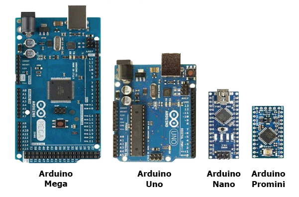
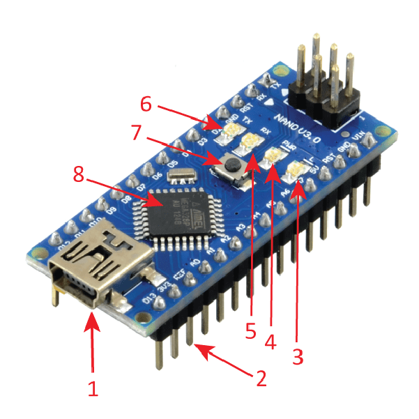
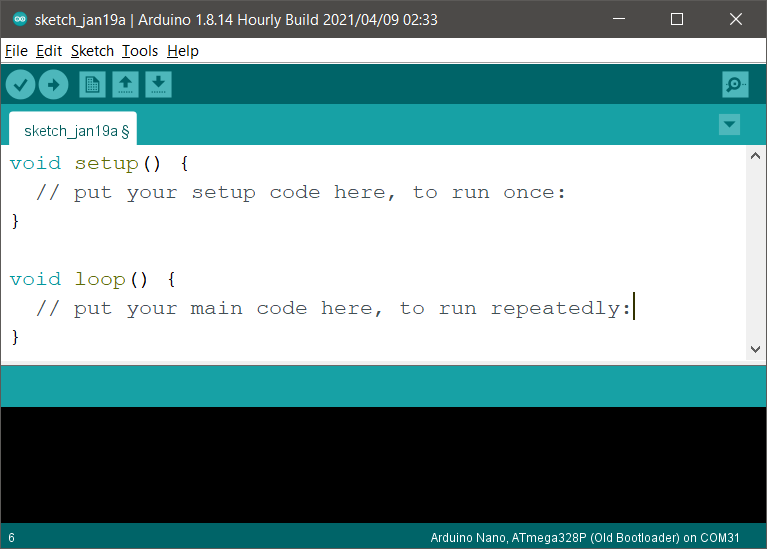
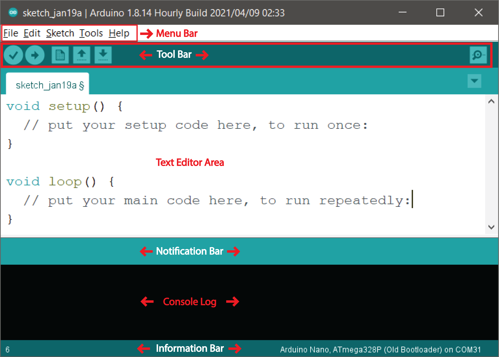

# Pendahuluan 👋

Karena dokumentasi ini bertujuan untuk membantu mereka yang belajar bersama RoboKarsa, maka dokumentasi ini tidak akan membahas secara detil mengenai sejarah **Arduino**, namun cukup untuk membuat teman-teman semua memahami apa itu **Arduino** dalam waktu singkat.

Pada dasarnya, dokumentasi yang ada pada situs ini merupakan parafrase dan disaring dari berbagai sumber di internet. Namun sumber utama yang digunakan sebagai sumber untuk pembuatan dokumentasi ini berasal dari situs resmi Arduino itu sendiri. Teman-teman bisa mengunjungi dokumentasi resmi Arduino melalui tautan **[ini](https://docs.arduino.cc/learn/starting-guide/getting-started-arduino#setup)**.

Kalau teman-teman penasaran dan ingin tahu lebih lanjut mengenai sejarah dan awal mula **Arduino**, teman-teman bisa membacanya lebih lanjut pada situs resmi nya pada tautan **[ini](https://www.arduino.cc/en/about#what-is-arduino)** atau bisa juga melalui laman Wikipedia pada tautan **[ini](https://en.wikipedia.org/wiki/Arduino#History)**.

Topik **Pendahuluan** ini akan berisi perkenalan apa itu Arduino, Perangkat Keras Arduino (terutama perangkat Arduino yang akan digunakan sebagai perangkat utama pada kelas RoboKarsa), Perangkat Lunak Arduino, dan Mengapa harus Arduino?

## Perkenalan

Mari kita kenali dahulu apa itu **Arduino**.

<!-- Or **try Docusaurus immediately** with **[docusaurus.new](https://docusaurus.new)**. -->

Sebagai permulaan, mari kita pahami dahulu dari nama **Arduino**. Pada dasarnya, **Arduino** bisa dibilang sebagai nama dari sebuah merk. Sebuah merk untuk perangkat elektronik yang pada awalnya dibuat oleh sebuah perusahaan yang berbasis di Italia.

Untuk mempermudah memahami nama **Arduino**, kita akan menggunakan analogi dari merk produk mi instan yang paling kita kenal di Indonesia, yakni **Indomie**.

Kita semua pasti sudah tahu, **Indomie** memiliki beragam produk dengan varian rasa yang berbeda seperti Indomie Kari Ayam, Indomie Soto Mie, Indomie Mi Goreng dan masih banyak lagi.

Begitu pula **Arduino** memiliki beragam produk dengan varian fitur dan kemampuan yang berbeda seperti Arduino Uno, Arduino Nano, Arduino Mega, Arduino Due dan masih banyak lagi.

Jadi, jika kita membahas topik mengenai **Arduino Uno**, berarti kita sedang membahas salah satu produk **Arduino**, yaitu Arduino Uno. Jika kita membahas mengenai **Arduino Mega**, berarti kita sedang membahas salah satu produk Arduino, yaitu Arduino Mega.

Hal ini penting untuk dibahas pertama kali terlebih dahulu agar tidak melenceng dari topik yang akan dibahas pada dokumentasi ini karena kita akan sering menyebut nama **Arduino** kedepannya, misalnya teman-teman akan menjumpai istilah **Arduino IDE**, yang juga akan dibahas dalam dokumentasi dan tutorial ini.

## Perangkat yang akan digunakan

Di RoboKarsa, kita akan menggunakan Arduino Nano sebagai komponen utama kita untuk belajar, kita akan menceritakan beberapa detail tentang Arduino Nano agar teman-teman bisa menggunakannya untuk belajar bersama RoboKarsa nantinya. Di bawah ini adalah gambar dari Arduino Nano yang akan sering kita lihat selama belajar bersama RoboKarsa nantinya.

Pemilihan mikrokontroller Arduino Nano ini didasarkan pada harganya yang lebih terjangkau serta ukurannya yang kecil dan ringkas, namun memiliki fitur-fitur yang relatif cukup lengkap. Ada banyak komponen-komponen penting dari Arduino Nano yang harus diketahui oleh teman-teman terlebih dahulu agar bisa menggunakannya dengan baik di kelas.

Komponen-komponen Arduino Nano seperti yang ditunjukkan pada gambar di bawah ini akan dijelaskan lebih detail pada topik **[Arduino Hardware](/docs/tutorial-arduino/perangkat-keras-arduino)**.

## Perangkat lunak yang akan digunakan

Karena kita akan menggunakan perangkat Arduino Nano sebagai perangkat utama kita di kelas Robotika dan Pemrograman, maka kita akan menggunakan perangkat lunak Arduino IDE sebagai alat untuk menulis kode program di laptop kita. Di bawah ini adalah tangkapan layar atau _screenshot_ dari perangkat lunak Arduino IDE.

Tentu saja, Arduino IDE juga memiliki banyak fitur-fitur yang harus teman-teman pelajari terlebih dahulu agar bisa menggunakannya dengan baik. Beberapa fitur-fitur utama dari Arduino IDE yang harus diketahui teman-teman ditunjukkan pada gambar di bawah.

Penjelasan detail mengenai fitur-fitur dari Arduino IDE beserta bagaimana cara menginstall Arduino IDE di laptop teman-teman, bisa teman-teman lihat pada topik **[Instalasi Arduino IDE ](/docs/tutorial-arduino/instalasi-perangkat-lunak)**.

## Mengapa Arduino?

Di luar sana, bukan hanya Arduino saja produk yang bisa digunakan RoboKarsa sebagai perangkat untuk mendukung kelas pembelajaran Robotika dan Programming. Namun mengapa RoboKarsa tetap memilih untuk menggunakan Arduino?

✔️ **Mudah**. Arduino tergolong ramah dan mudah untuk pengguna pemula yang pengetahuannya mengenai bahasa pemrograman masih nol.

✔️ **_Open Source_**. RoboKarsa memilih untuk menggunakan Arduino sebagai perangkat pembelajaran di kelas robotika dan pemrograman karena sifatnya yang _Open Source_ atau bisa kita anggap sebagai sumber terbuka.

✔️ **Murah**. Selain itu, karena sifatnya yang _Open Source_, menyebabkan banyak yang bisa memproduksi produk Arduino versi tiruan dengan harga yang lebih murah namun tetap memiliki fitur dan kemampuan yang sama. Walau kita harus teliti dan berhati-hati ketika menggunakan produk tiruan.

✔️ **Banyak Dukungan**. Tak hanya itu, karena Arduino sudah digunakan oleh banyak orang di seluruh dunia, banyak komunitas dan banyak kreator yang mendukung dalam pembuuatan program-program pendukung untuk kita gunakan sehingga membuatnya menjadi lebih mudah untuk dipelajari oleh pemula.

✔️ **Beragam Project**. Walau belum tentu menjadi poin terakhir, terdapat banyak project-project Arduino yang bertebaran di Internet yang dapat kita Amati-Tiru-Modifikasi (ATM), baik untuk keperluan pribadi maupun untuk keperluan belajar.

Dokumentasi ini akan membantu agar pemula menjadi lebih mudah lagi untuk mempelajari perangkat Arduino.
