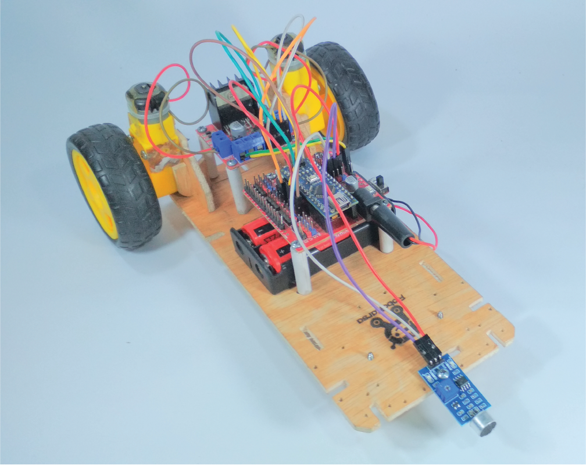
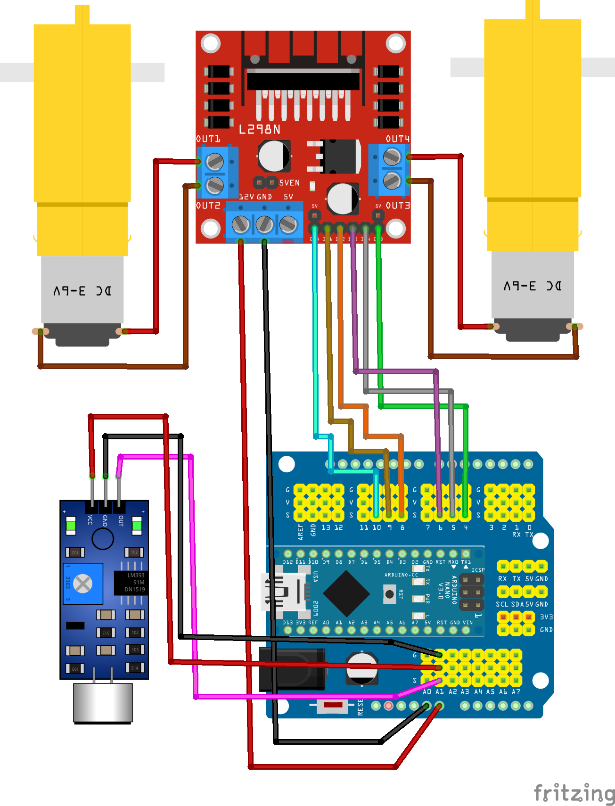

import Tabs from '@theme/Tabs';
import TabItem from '@theme/TabItem';

# Handclap Robot

## Perkenalan

<div width="100%" style={{textAlign: 'center'}}>



</div>

Project ini akan memadukan Sensor Suara yang akan berfungsi sebagai telinga robot untuk mendeteksi suara tepuk tangan kita.

Apabila robot mendeteksi suara tepuk tangan, maka robot akan berjalan maju.

Penasaran bagaimana hasilnya? Mari kita langsung merangkai.

## Alat dan Komponen yang diperlukan

<Tabs className="unique-tabs">
<TabItem value="Alat 🛠">

- Obeng Plus

</TabItem>

<TabItem value="Komponen Yang Dibutuhkan 🔑">

- 1 x Arduino Nano
- 1 x Kabel USB Arduino Nano
- 1 x Komputer/Laptop
- 1 x Sensor Suara
- 1 x Driver Motor
- 2 X Motor DC + Ban
- 1 x Kotak Baterai 2 Slot
- 2 x Baterai
- Baut seperlunya
- Kabel Jumper seperlunya

</TabItem>
</Tabs>

## Petunjuk Merakit

### ◼️ Merakit Komponen Utama

#### ▪️ Memasang Dudukan Motor ke Rangka Utama

1. Siapkan dua buah Dudukan Motor dan Rangka Utama seperti pada gambar di bawah ini.
   <p align="center" width="100%">

   

   

   </p>

2. Kemudian ambil salah satu dari dudukan motor. Kita akan memasang untuk sisi kiri terlebih dahulu. Pasangkan dudukan motor pada rangka utama dengan posisi seperti pada gambar di bawah ini.
   <p align="center" width="100%">

   

   

   </p>

3. Selanjutnya kita akan memasang untuk sisi kanan. Pasangkan dudukan motor pada rangka utama dengan posisi seperti pada gambar di bawah ini.
   <p align="center" width="100%">

   

   

   </p>

#### ▪️ Memasang Motor Kiri

4. Setelah kedua dudukan motor terpasang, selanjutnya kita akan memasang motor kiri. Siapkan terlebih dahulu motor DC seperti ditunjukkan pada gambar di bawah ini.
   <p align="center" width="100%">

   

   <br/>
   Sebelumnya, pastikan titik tengah pada motor DC seperti yang ditunjuk oleh tanda panah di bawah ini menghadap atas.

   

   </p>

5. Kemudian masukkan baut panjang pada lubang sebelah kanan pada Motor DC seperti ditunjukkan pada gambar di bawah.

   <p align="center" width="100%">

   

   

   </p>

6. Masukkan baut panjang pada lubang sebelah kiri pada Motor DC seperti ditunjukkan pada gambar di bawah.

   <p align="center" width="100%">

   

   

   </p>

7. Selanjutnya, kita akan mengencangkan Motor DC pada Dudukan Motor menggunakan baut panjang yang telah kita pasang tadi. Sejajarkan ujung baut panjang pada lubang yang tersedia pada Dudukan Motor DC seperti ditunjukkan pada gambar di bawah ini.

   <p align="center" width="100%">

   

   

   </p>

8. Selanjutnya, kita akan mengencangkan Motor DC pada Dudukan Motor menggunakan baut panjang yang telah kita pasang tadi. Sejajarkan ujung baut panjang pada lubang yang tersedia pada Dudukan Motor DC seperti ditunjukkan pada gambar di bawah ini.

   <p align="center" width="100%">

   

   

   </p>

9. Setelah ujung baut panjang sejajar dengan lubang pada Dudukan Motor DC, kencangkan kedua baut tersebut dengan obeng seperti pada gambar di bawah ini.

   <p align="center" width="100%">

   

   

   <br/>

   Setelah dikencangkan, Motor DC akan tetap diam pada Dudukan Motor seperti pada gambar di bawah ini.
   

   </p>

#### ▪️ Memasang Motor Kanan

10. Selanjutnya, kita akan memasang Motor DC pada dudukan kanan. Langkah-langkahnya sama seperti memasang Motor DC kiri sebelumnya. Setelah Motor DC kanan terpasang, hasil akhirnya akan seperti pada gambar di bawah ini.

   <p align="center" width="100%">

    

    

   </p>

#### ▪️ Memasang Roda Bebas

11. Langkah berikutnya, kita akan memasang roda bebas, yakni roda yang bebas bergerak ke arah manapun. Siapkan komponen roda bebas seperti yang ditunjukkan pada gambar di bawah.
    <p align="center" width="100%">

    

   </p>

12. Kemudian kita akan memasang roda bebas tersebut pada sisi bawah rangka utama. Perhatikan baik-baik gambar di bawah.
    <p align="center" width="100%">

    

    Sejajarkan lubang yang terdapat pada roda bebas dengan lubang yang terdapat pada bagian bawah rangka utama seperti yang ditunjuk oleh tanda panah di bawah.
    

    

    Kencangkan roda bebas dengan baut seperti ditunjuk pada gambar di bawah.
    

   </p>

13. Maka hasil akhirnya akan seperti pada gambar di bawah. Bagian depan rangka utama akan tampak naik karena terdapat roda bebas di bawahnya.
    <p align="center" width="100%">

    

   </p>

#### ▪️ Memasang Ban

14. Selanjutnya kita akan memasang ban pada Motor DC. Siapkan dua buah ban Motor DC seperti pada gambar di bawah.
    <p align="center" width="100%">

    

   </p>

15. Kita akan memasang ban nya pada poros Motor DC yang berwarna putih.
     <p align="center" width="100%">

    

     <br/>
     Namun sebelum itu, perhatikan terlebih dahulu kalau terdapat bentuk yang unik antara poros Motor DC dan poros Ban. Pastikan antara poros Motor DC dan poros Ban sudah sejajar seperti ditandai pada gambar di bawah ini. 
     

     <br/>
     Setelah sejajar, doronglah Ban tersebut ke poros Motor DC secara perlahan.
     
    </p>

16. Lakukanlah hal yang sama untuk ban sebelah kanan. Jika kedua ban sudah terpasang, maka hasilnya akan seperti pada gambar di bawah ini.

    <p align="center" width="100%">

    

   </p>

#### ▪️ Memasang Driver Motor

17. Selanjutnya kita akan memasang Driver Motor pada rangka utama. Siapkan 4 buah spacer kertas dan Driver Motor L298N seperti pada gambar di bawah ini.

     <p align="center" width="100%">

    

    
    </p>

18. Bukalah baut yang sebelumnya masih terpasang pada spacer kertas. Kemudian pasang keempat spacer kertas tersebut pada keempat lubang yang terdapat pada Driver Motor L298N. Hasil akhirnya akan seperti pada gambar di bawah ini yang menunjukkan keempat spacer kertas telah terpasang pada Driver Motor L298N.

     <p align="center" width="100%">

    

    </p>

19. Setelah memasang keempat spacer kertas pada Driver Motor L298N, selanjutnya kita akan memasangkannya pada rangka utama. Namun sebelum itu, perhatikan terlebih dahulu keempat posisi lubang pada rangka utama untuk memasang Driver Motor L298N di bawah ini.
     <p align="center" width="100%">

    

    <br/>
    Tancapkan dan sejajarkan ujung tajam spacer kertas pada keempat lubang tersebut dengan posisi seperti ditunjukkan pada gambar di bawah ini.

    

    <br/>
    Apabila sudah keempat lubang sudah sejajar dengan keempat ujung spacer kertas, tekanlah hingga ujung spacer kertas terbenam sepenuhnya.

    

    </p>

20. Hasil akhir apabila Driver Motor L298N telah terpasang pada rangka utama akan seperti pada gambar di bawah ini.
     <p align="center" width="100%">

    

    </p>

#### ▪️ Memasang Kotak Baterai

20. Selanjutnya kita akan memasang kotak baterai pada rangka utama. Siapkan komponen di bawah ini.
     <p align="center" width="100%">

    

    </p>

21. Pada rangka utama terdapat dua buah lubang baut untuk memasang kotak baterai seperti ditunjukkan pada gambar di bawah ini.
     <p align="center" width="100%">

    

    <br/>
    Sejajarkan dua buah lubang pada rangka utama tersebut dengan dua buah lubang yang terdapat pada kotak baterai.

    

    <br/>
    Kemudian kencangkan dua buah lubang tersebut dengan dua buah baut.

    

    </p>

22. Maka hasil akhirnya setelah kotak baterai terpasang akan seperti pada gambar di bawah ini.
     <p align="center" width="100%">

    

    </p>

#### ▪️ Memasang Baterai

23. Selanjutnya kita akan memasang dua buah baterai pada kotak baterai tersebut. Siapkan dua buah baterai seperti pada gambar di bawah ini.
     <p align="center" width="100%">

    

    </p>

24. Kemudian masukkan salah satu baterai ke slot pertama pada kotak baterai. Perhatikan petunjuk pada gambar di bawah. Masukkan baterai dengan kutub negatif masuk terlebih dahulu ke pegas pada kotak baterai.
     <p align="center" width="100%">

    

    <br/>

    Kemudian tekan hingga baterai masuk sepenuhnya pada slot pertama kotak baterai.
    

    </p>

25. Lakukan hal yang sama untuk baterai kedua. Masukkan baterai dengan kutub negatif masuk terlebih dahulu menghadap pegas pada kotak baterai seperti ditunjukkan oleh gambar di bawah ini.
     <p align="center" width="100%">

    

    <br/>

    Kemudian tekan hingga baterai masuk sepenuhnya pada slot kotak baterai.
    

    </p>

26. Untuk keamanan, sebelum lanjut ke langkah berikutnya, pastikan posisi saklar pada kotak baterai sudah berada pada posisi OFF seperti ditunjukkan pada gambar di bawah ini.
     <p align="center" width="100%">

    

    </p>

27. Beginilah hasil akhirnya apabila kita telah memasang baterai pada kotak baterai.
     <p align="center" width="100%">

    

    </p>

#### ▪️ Memasang Arduino Nano

28. Selanjutnya kita akan memasang Arduino Nano pada rangka utama. Siapkan 4 buah spacer kertas dan Arduino Nano.
     <p align="center" width="100%">

    

    

    </p>

29. Pasangkan keempat spacer kertas pada keempat lubang yang terdapat pada Arduino Nano sehingga menjadi seperti pada gambar di bawah ini.
     <p align="center" width="100%">

    

    </p>

30. Setelah keempat spacer kertas dipasang, kita akan memasangkan pada rangka utama. Perhatikan tanda panah pada gambar di bawah ini. Lubang yang ditandai oleh tanda panah putih pada gambar di bawah ini adalah lubang tempat kita memasukkan keempat ujung spacer kertas tadi.
     <p align="center" width="100%">

    

    <br/>
    Sejajarkan keempat ujung spacer kertas dengan keempat lubang pada rangka utama seperti ditunjukkan pada gambar di bawah ini.

    
    
    </p>

31. Kemudian tekan keempat spacer kertas hingga bagian putih spacer kertas menyentuh rangka utama seperti pada gambar di bawah ini.
     <p align="center" width="100%">
    
    
    </p>

#### ▪️ Memasang Sensor Suara

32. Selanjutnya, kita akan memasang sensor suara pada rangka utama. Siapkan sensor suara.
     <p align="center" width="100%">
    
    </p>

33. Kemudian kita akan memasangnya pada rangka utama. Kita akan memasang Sensor Jarak pada lubang baut pada rangka utama seperti yang ditunjukkan oleh tanda panah di bawah.
     <p align="center" width="100%">
    
    <br/>
    Sejajarkan lubang baut pada rangka utama dengan lubang baut pada Sensor Jarak. Kemudian kencangkan dengan baut seperti pada gambar di bawah ini.
        
    </p>

34. Maka hasil finalnya secara keseluruhan akan seperti pada gambar di bawah ini.
     <p align="center" width="100%">
    
    </p>

### ◼️ Wiring Diagram

Selanjutnya, kita akan merangkai dan menghubungkan komponen-komponen tersebut dengan kabel jumper.

#### ▪️ Diagram Gambar

Teman-teman bisa gunakan gambar Wiring Diagram di bawah ini sebagai petunjuk untuk merangkai kabel-kabelnya.

<div width="100%" style={{textAlign: 'center'}}>



</div>

#### ▪️ Diagram Tabel

Apabila titik ujung kabel pada gambar di atas kurang jelas, teman-teman bisa gunakan tabel di bawah ini.

<table>
<tr><th>Modul l298N </th><th>Sensor Suara</th></tr>
<tr><td>

| Modul L298N | Arduino Nano Expansion Board |
| :---------: | :--------------------------: |
|     ENA     |            Pin 10            |
|     IN1     |            Pin 9             |
|     IN2     |            Pin 8             |
|     IN3     |            Pin 6             |
|     IN4     |            Pin 5             |
|     ENB     |            Pin 4             |
|     12V     |             VIN              |
|     GND     |             GND              |

</td><td>

| Sensor Suara | Arduino Nano Expansion Board |
| :----------: | :--------------------------: |
|     VCC      |            Pin V             |
|     Trig     |            Pin 13            |
|     Echo     |            Pin 12            |
|     GND      |            Pin G             |

</td></tr> </table>

<table>
<tr><th>Motor Kiri </th><th>Motor Kanan</th></tr>
<tr><td>

|  Motor Kiri  | Modul L298N |
| :----------: | :---------: |
| Kabel Merah  |    OUT 1    |
| Kabel Coklat |    OUT 2    |

</td><td>

| Motor Kanan  | Modul L298N |
| :----------: | :---------: |
| Kabel Merah  |    OUT 4    |
| Kabel Coklat |    OUT 3    |

</td></tr> </table>

<br/>

## Mengetik Program

Kemudian ketik program di bawah ini. Setelah selesai mengetik, jalankan proses Verify. Setelah proses verify dan compiling selesai, upload programnya ke Arduino Nano.

```arduino title="RoboKarsa_Handclap_Robot.ino" showLineNumbers
// Motor A connections
//Red Cable goes to OUT1
//Brown Cable goes to OUT2
int enA = 10;
int in1 = 9;
int in2 = 8;

// Motor B connections
//Red Cable goes to OUT4
//Brown Cable goes to OUT3
int in3 = 6;
int in4 = 5;
int enB = 4;

void setup() {

  Serial.begin(9600); // Start Serial for Debugging @9600 Baud

  pinMode(LED_BUILTIN, OUTPUT); // D13 as Drive Output

  // Set all the motor control pins to outputs
  pinMode(enA, OUTPUT);
  pinMode(enB, OUTPUT);
  pinMode(in1, OUTPUT);
  pinMode(in2, OUTPUT);
  pinMode(in3, OUTPUT);
  pinMode(in4, OUTPUT);
}

void loop() {

  int analog_val;

  static bool led_state = false;

  analog_val = analogRead(A1); // A2 as Signal Input
  Serial.println(analog_val);

  if (analog_val > 480) { // Threshold Value – Tweak Yourself!

      digitalWrite(LED_BUILTIN, HIGH); // Drive Output = ON
      Serial.println("Reversed");
      forward();
      delay(1000); // Halt for a while
  }

   else if (analog_val<480) {

      digitalWrite(LED_BUILTIN, LOW); // Drive Output = OFF
      Serial.println("Halted");
      halt();
    }

}

void forward(){
  analogWrite(enA, 250);
  analogWrite(enB, 250);

  digitalWrite(in1, HIGH);
  digitalWrite(in2, LOW);
  digitalWrite(in3, HIGH);
  digitalWrite(in4, LOW);
  //delay(2000);
}

void backward(){
  analogWrite(enA, 250);
  analogWrite(enB, 250);

  digitalWrite(in1, LOW);
  digitalWrite(in2, HIGH);
  digitalWrite(in3, LOW);
  digitalWrite(in4, HIGH);
  //delay(500);
}

void turnLeft(){
  analogWrite(enA, 250);
  analogWrite(enB, 250);

  digitalWrite(in1, HIGH);
  digitalWrite(in2, LOW);
  digitalWrite(in3, LOW);
  digitalWrite(in4, HIGH);
  //delay(2000);
}

void turnRight(){
  analogWrite(enA, 250);
  analogWrite(enB, 250);

  digitalWrite(in1, LOW);
  digitalWrite(in2, HIGH);
  digitalWrite(in3, HIGH);
  digitalWrite(in4, LOW);
  //delay(2000);
}

void halt(){
  digitalWrite(in1, LOW);
  digitalWrite(in2, LOW);
  digitalWrite(in3, LOW);
  digitalWrite(in4, LOW);
}
```
