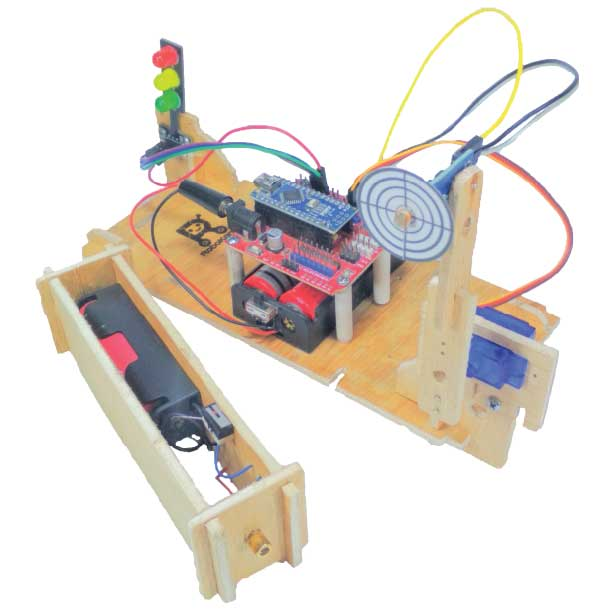
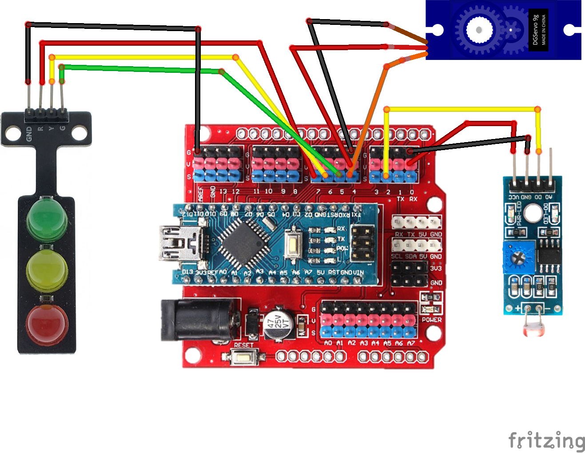

import Tabs from '@theme/Tabs';
import TabItem from '@theme/TabItem';

# Laser Shooting Game - Single Player 🔫

## Perkenalan

<div width="100%" style={{textAlign: 'center'}}>



</div>

Seberapa bagus dan stabil tangan teman-teman?

Kita akan membuat permainan menembak laser untuk melatih kestabilan tangan kita dan juga untuk seru-seruan dikala gabut.

Permainan ini akan menggunakan sensor LDR untuk mendeteksi cahaya laser yang kita tembakkan. Kemudian menggunakan Servo Motor untuk menggerakkan sensor LDR nya ke posisi acak ketika kita berhasil mengenainya.

Untuk mencatat skor nya, kita akan menggunakan Modul LED. Kita akan mencatat waktu tercepat yang bisa teman-teman capai untuk memadamkan lampu merah yang berkedip pada Modul LED.

Semakin cepat lampu merah dipadamkan, semakin stabil dan jago tangan kita menembakkan laser.

## Alat dan Komponen yang diperlukan

<Tabs className="unique-tabs">
<TabItem value="Alat 🛠">

- Obeng Plus
- Laser Pointer

</TabItem>

<TabItem value="Komponen Yang Dibutuhkan 🔑">

- 1 x Arduino Nano
- 1 x Kabel USB Arduino Nano
- 1 x Komputer/Laptop
- 1 x Servo
- 1 X Lengan Robot
- 1 x Sensor LDR
- 1 x Modul LED
- 1 x Kotak Baterai 2 Slot
- 2 x Baterai
- Baut seperlunya
- Kabel Jumper seperlunya

</TabItem>
</Tabs>

## Petunjuk Merakit

### ◼️ Merakit Komponen Utama

#### ▪️ Memasang Kotak Baterai

1. Siapkan komponen pertama, yakni rangka utama.

   <p align="center" width="100%"> </p>

2. Kemudian siapkan kotak baterai seperti ditunjukkan oleh gambar di bawah.

   <p align="center" width="100%"> </p>

3. Perhatikan bahwa terdapat dua buah lubang pada kotak baterai seperti yang ditunjukkan oleh tanda panah putih nomor satu dan dua.
   <p align="center" width="100%"> </p>

   Lubang pada kotak baterai tersebut sejajar dengan lubang pada rangka utama seperti yang ditunjukkan oleh tanda panah hitam nomor satu dan dua.

   <p align="center" width="100%"> </p>

4. Lubang tersebut akan dijadikan sebagai lubang untuk memasang baut. Contoh baut yang telah terpasang ditunjukkan seperti pada gambar di bawah ini
   <p align="center" width="100%"> </p>

5. Baik, sekarang kotak baterai telah terpasang, hasilnya akan seperti pada gambar di bawah ini.
   <p align="center" width="100%"> </p>

   Selanjutnya kita akan memasang baterai pada kotak baterai.

#### ▪️ Memasang Baterai

6. Setelah kotak baterai terpasang, kita akan memasang baterai. Siapkan dua buah baterai seperti pada gambar di bawah ini.
   <p align="center" width="100%"> </p>

7. Masukkan baterai ke kotak baterai. Perhatikan, kutub negatif baterai yang ditandai oleh tanda negatif ➖, masuk terlebih dahulu ke pegas pada kotak baterai.
   <p align="center" width="100%"> </p>

   Hasilnya akan seperti pada gambar di bawah ini.
   <p align="center" width="100%"> </p>

   Selanjutnya kita akan memasang baterai berikutnya.

8. Sama seperti langkah 7 di atas sebelumnya, masukkan baterai ke kotak baterai dengan kutub negatif baterai yang ditandai oleh tanda negatif ➖, masuk terlebih dahulu ke pegas pada kotak baterai.
   <p align="center" width="100%"> </p>

   Hasilnya akan seperti pada gambar di bawah ini.
   <p align="center" width="100%"> </p>

   Setelah kedua baterai terpasang pada kotak baterai, hasilnya akan menjadi seperti di bawah ini.
   <p align="center" width="100%"> </p>

#### ▪️ Memasang Arduino Nano

9. Selanjutnya kita akan memasang Arduino Nano ke rangka utama. Siapkan 4 buah spacer kertas dan Arduino Nano.
   <p align="center" width="100%"> </p>

   Bukalah baut pada keempat spacer kertas tersebut, kemudian pasangkan ke lubang baut pada Arduino Nano.

   <p align="center" width="100%"> </p>

10. Setelah keempat spacer kertas terpasang pada Arduino Nano, akan menjadi seperti ini.
    <p align="center" width="100%">

    

    

    </p>

11. Setelah keempat spacer kertas terpasang pada Arduino Nano, selanjutnya kita akan memasang Arduino Nano ke rangka utama. Namun sebelumnya, perhatikan terlebih dahulu lubang-lubang yang ditunjukkan oleh tanda panah putih pada gambar di bawah ini.
    <p align="center" width="100%"> </p>

    Kita akan menancapkan keempat kaki spacer kertas pada keempat lubang tersebut.

12. Tancapkan kaki spacer bagian depan Arduino Nano pada lubang. Setelah sejajar dengan lubang, tekan hingga masuk sepenuhnya.

    <p align="center" width="100%">

    

    

    </p>

13. Lakukan hal yang sama untuk dua kaki yang tersisa di belakangnya.

    <p align="center" width="100%">

    

    

    </p>

14. Apabila Arduino Nano telah terpasang pada rangka utama, maka hasilnya akan seperti pada gambar di bawah ini
    <p align="center" width="100%"> </p>

#### ▪️ Memasang Modul LED

14. Selanjutnya kita akan memasang Modul LED yang akan kita gunakan untuk mencatat jumlah tembakan yang tepat sasaran. Siapkan Modul LED dan Komponen Dudukan Motor seperti yang ditunjukkan oleh gambar di bawah ini.
    <p align="center" width="100%"> </p>

15. Kemudian sejajarkan lubang 1 dan lubang 2 Modul LED dengan lubang 1 dan lubang 2 Dudukan Motor seperti yang ditunjuk oleh gambar di bawah ini.

    <p align="center" width="100%">

    

    

    </p>

16. Selanjutnya kita akan mengencangkan Modul LED pada Dudukan Motor dengan menggunakan dua buah baut. Kita akan memasang dua buah baut pada dua lubang yang sejajar tadi. Hasilnya akan seperti pada gambar di bawah ini. Dua buah baut telah terpasang pada lubang Modul LED dan Dudukan Motor.

    <p align="center" width="100%">

    

    </p>

17. Setelah kita mengencangkan Modul LED pada Dudukn Motor, kita akan memasang keduanya pada rangka utama. Pasanglah dengan posisi seperti yang ditunjukkan oleh gambar di bawah.

    <p align="center" width="100%">

    

    

    </p>

18. Maka hasil akhirnya akan seperti pada gambar di bawah ini.

    <p align="center" width="100%">

    

    </p>

#### ▪️ Memasang Servo

19. Selanjutnya kita akan memasang Servo pada Dudukan Motor. Siapkan Servo Motor seperti ditunjukkan oleh gambar di bawah.

    <p align="center" width="100%">

    

    </p>

20. Kemudian siapkan Dudukan Motor, sejajarkan lubang 1 dan lubang 2 pada Servo dengan lubang 1 dan lubang 2 Dudukan Motor. Kencangkan dua lubang tersebut dengan dua buah baut.

    <p align="center" width="100%">

    

    </p>

21. Maka hasilnya akan seperti pada gambar di bawah ini.

    <p align="center" width="100%">

    

    </p>

22. Selanjutnya kita akan memasangnya ke rangka utama. Pasanglah dengan posisi seperti pada gambar di bawah ini.

    <p align="center" width="100%">

    

    

    </p>

23. Setelah terpasang pada rangka utama, maka hasil akhirnya akan seperti pada gambar di bawah ini.

    <p align="center" width="100%">

    

    </p>

#### ▪️ Memasang Sensor LDR

24. Langkah selanjutnya, kita akan memasang Sensor LDR pada Lengan Robot. Siapkan komponen seperti pada gambar di bawah ini.

    <p align="center" width="100%">

    

    

    </p>

25. Selanjutnya, perhatikan baik-baik posisi lengan robot pada gambar di bawah ini. Sejajarkan lubang pada Sensor LDR ke lubang paling ujung pada lengan robot.
    <p align="center" width="100%">
    
    <br/>
    Kemudian kencangkan dengan satu buah baut seperti pada gambar di bawah ini.

    

    </p>

26. Setelah terpasang, kita akan mengencangkan lengan robot dengan baut kecil pada lubang seperti yang ditunjuk oleh tanda panah di bawah.
    <p align="center" width="100%">
    
    <br/>
    <br/>
    Berikut hasilnya setelah baut kecil terpasang.

    

    </p>

27. Langkah terakhir, kita akan memasang papan target pada Sensor LDR. Pasang dengan posisi seperti yang ditunjuk oleh gambar di bawah ini.
    <p align="center" width="100%">
    
    <br/>
    <br/>
    Berikut hasilnya setelah papan target terpasang.

    

    </p>

28. Setelah semua komponen terpasang, hasil finalnya akan seperti pada gambar di bawah ini.
    <p align="center" width="100%">
    

    </p>

### ◼️ Wiring Diagram

Jika sudah selesai memasang semua komponen ke rangka utama, selanjutnya kita akan merangkai dan menghubungkan komponen tersebut dengan kabel jumper.

#### ▪️ Diagram Gambar

Teman-teman bisa gunakan gambar Wiring Diagram di bawah ini sebagai petunjuk untuk merangkai kabel-kabelnya.

<div width="100%" style={{textAlign: 'center'}}>



</div>

#### ▪️ Diagram Tabel

Apabila titik ujung kabel pada gambar di atas kurang jelas, teman-teman bisa gunakan tabel di bawah ini.

<table>
<tr><th>Modul Servo </th><th>LDR Sensor</th></tr>
<tr><td>

| Modul Servo  | Arduino Nano Expansion Board |
| :----------: | :--------------------------: |
| Kabel Kuning |            Pin 4             |
| Kabel Merah  |            Pin V             |
| Servo Hitam  |            Pin G             |

</td><td>

| LDR Sensor | Arduino Nano Expansion Board |
| :--------: | :--------------------------: |
|    VCC     |            Pin V             |
|    GND     |            Pin G             |
|     D0     |            Pin 2             |

</td></tr> </table>

<table>
<tr><th>LED Module</th></tr>
<tr><td>

| LED Module | Arduino Nano Expansion Board |
| :--------: | :--------------------------: |
|    GND     |            Pin G             |
|     R      |            Pin 7             |
|     Y      |            Pin 6             |
|     G      |            Pin 5             |

</td></tr> </table>

## Mengetik Program

Kemudian ketik program di bawah ini. Setelah selesai mengetik, jalankan proses Verify. Setelah proses verify dan compiling selesai, upload programnya ke Arduino Nano.

```arduino title="RoboKarsa_Laser_Shooter_Game.ino" showLineNumbers
#include<Servo.h>
#include <Ultrasonic.h>

Ultrasonic ultrasonic(4, 5);
int distance;

int number=0;
int randomdelay=0;

Servo servo1;
Servo servo2;
Servo servo3;

// Variables will change:
int moveState = 0;         // current state of the move
int lastMoveState = 0;     // previous state of the move

void setup() {
  // initialize the LED as an output:
  pinMode(13, OUTPUT);
  // initialize serial communication:
  Serial.begin(9600);
  servo1.attach(9);
  servo2.attach(10);
  servo3.attach(11);

  //initialize starting servo sequence
  servo1.write(0);
  servo2.write(0);
  servo3.write(0);
  delay(300);
  servo1.write(90);
  delay(300);
  servo2.write(90);
  delay(300);
  servo3.write(90);
  delay(500);
  servo3.write(0);
  delay(150);
  servo2.write(0);
  delay(150);
  servo1.write(0);
  delay(150);
  servo1.write(90);
  servo2.write(90);
  servo3.write(90);
  delay(300);
  servo1.write(0);
  servo2.write(0);
  servo3.write(0);
}


void loop() {

  delay(100);                     // Wait 50ms between pings (about 20 pings/sec). 29ms should be the shortest delay between pings.
  Serial.print("Jarak: ");
  distance = ultrasonic.read();
  Serial.print(distance);
  Serial.println("cm");
  if (distance<=15){
    moveState=LOW;
  }
  else if(distance>=15){
    moveState=HIGH;
  }
  // compare the moveState to its previous state
  if (moveState != lastMoveState) {
    // if the state has changed, do the robot move
    if (moveState == HIGH) {

      digitalWrite(13,LOW);
      servo1.write(0);
      servo2.write(0);
      servo3.write(0);
    } else {
      number = random(3);
      Serial.println(number);
      digitalWrite(13,HIGH);
      if(number==0)
      {
        servo1.write(0);
        servo2.write(90);
        servo3.write(0);
        delay(2000);
        }
      else if(number==1)
      {
        servo1.write(0);
        servo2.write(0);
        servo3.write(90);
        delay(2000);
        }
      else if(number==2)
      {
        servo1.write(90);
        servo2.write(0);
        servo3.write(0);
        delay(2000);
        }
    }
    // Delay a little bit to avoid bouncing
    delay(50);
  }
  // save the current state as the last state, for next time through the loop
  lastMoveState = moveState;

}
```

<!-- ## In Action

Hasilnya akan seperti pada video pendek berikut -->
