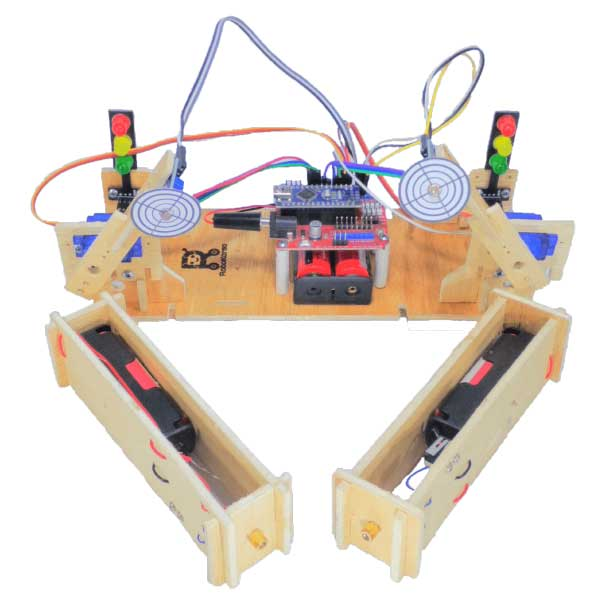
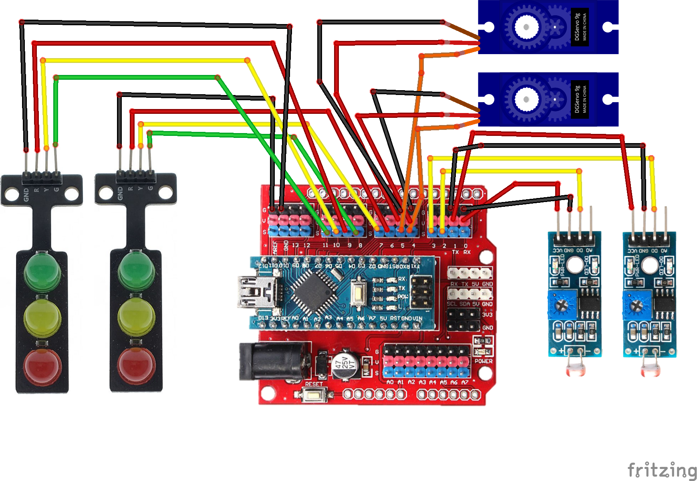

import Tabs from '@theme/Tabs';
import TabItem from '@theme/TabItem';

# Laser Shooting Game - Multiplayer 🎮

## Perkenalan

<div width="100%" style={{textAlign: 'center'}}>



</div>

Permainan ini sebenarnya lanjutan dari project sebelumnya, hanya saja kali ini kita akan membuat dua buah papan target agar bisa bertanding melawan teman kita.

Siapa yang pertama kali memadamkan lampu LED yang berkedip, maka dialah pemenangnya.

## Alat dan Komponen yang diperlukan

<Tabs className="unique-tabs">
<TabItem value="Alat 🛠">

- Obeng Plus
- Laser Pointer

</TabItem>

<TabItem value="Komponen Yang Dibutuhkan 🔑">

- 1 x Arduino Nano
- 1 x Kabel USB Arduino Nano
- 1 x Komputer/Laptop
- 2 x Servo
- 2 X Lengan Robot
- 2 x Sensor LDR
- 2 x Modul LED
- 1 x Kotak Baterai 2 Slot
- 2 x Baterai
- Baut seperlunya
- Kabel Jumper seperlunya

</TabItem>
</Tabs>

## Petunjuk Merakit

### ◼️ Merakit Komponen Utama

Karena project ini merupakan lanjutan dari project sebelumnya, maka petunjuk merakit untuk project ini akan sama seperti pada project sebelumnya.

Hanya saja, perbedaannya, pada project sebelumnya, terdapat satu buah Modul LED dan satu buah lengan robot seperti pada gambar di bawah ini.

<p align="center" width="100%">     </p>

Sedangkan pada project ini, terdapat dua buah Modul LED dan dua buah lengan robot seperti pada gambar di bawah ini.

<p align="center" width="100%">     </p>

Cobalah merakit project ini menggunakan petunjuk pada project sebelumnya, namun dengan modifikasi berupa tambahan satu buah Modul LED dan satu buah lengan robot.

Setelah berhasil merakit seperti pada gambar di atas, kembalilah kesini lagi, karena project ini memiliki Wiring Diagramnya sendiri yang harus diikuti di bawah ini.

### ◼️ Wiring Diagram

Karena pada Project ini, kita akan membuat Game Laser Shooting agar bisa dimainkan oleh dua pemain, maka kita akan memasang dua buah Modul LED, dua buah Servo Motor, dan dua buah Sensor LDR.

#### ▪️ Diagram Gambar

Teman-teman bisa gunakan gambar Wiring Diagram di bawah ini sebagai petunjuk untuk merangkai kabel-kabelnya.

<div width="100%" style={{textAlign: 'center'}}>



</div>

#### ▪️ Diagram Tabel

Apabila titik ujung kabel pada gambar di atas kurang jelas, teman-teman bisa gunakan tabel di bawah ini.

##### - Pemain Pertama

Tabel Diagram di bawah ini sebagai petunjuk untuk memasang komponen untuk sisi pemain pertama. Gunakan sisi kiri sebagai sisi untuk pemain pertama.

<table>
<tr><th>Modul Servo </th><th>LDR Sensor</th></tr>
<tr><td>

| Modul Servo  | Arduino Nano Expansion Board |
| :----------: | :--------------------------: |
| Kabel Kuning |            Pin 4             |
| Kabel Merah  |            Pin V             |
| Servo Hitam  |            Pin G             |

</td><td>

| LDR Sensor | Arduino Nano Expansion Board |
| :--------: | :--------------------------: |
|    VCC     |            Pin V             |
|    GND     |            Pin G             |
|     D0     |            Pin 2             |

</td></tr> </table>

<table>
<tr><th>LED Module</th></tr>
<tr><td>

| LED Module | Arduino Nano Expansion Board |
| :--------: | :--------------------------: |
|    GND     |            Pin G             |
|     R      |            Pin 6             |
|     Y      |            Pin 7             |
|     G      |            Pin 8             |

</td></tr> </table>

<br/>

##### - Pemain Kedua

Tabel Diagram di bawah ini sebagai petunjuk untuk memasang komponen untuk sisi pemain pertama. Gunakan sisi kanan sebagai sisi untuk pemain kedua.

<table>
<tr><th>Modul Servo </th><th>LDR Sensor</th></tr>
<tr><td>

| Modul Servo  | Arduino Nano Expansion Board |
| :----------: | :--------------------------: |
| Kabel Kuning |            Pin 5             |
| Kabel Merah  |            Pin V             |
| Servo Hitam  |            Pin G             |

</td><td>

| LDR Sensor | Arduino Nano Expansion Board |
| :--------: | :--------------------------: |
|    VCC     |            Pin V             |
|    GND     |            Pin G             |
|     D0     |            Pin 3             |

</td></tr> </table>

<table>
<tr><th>LED Module</th></tr>
<tr><td>

| LED Module | Arduino Nano Expansion Board |
| :--------: | :--------------------------: |
|    GND     |            Pin G             |
|     R      |            Pin 9             |
|     Y      |            Pin 10            |
|     G      |            Pin 11            |

</td></tr> </table>

## Mengetik Program

Kemudian ketik program di bawah ini. Setelah selesai mengetik, jalankan proses Verify. Setelah proses verify dan compiling selesai, upload programnya ke Arduino Nano.

```arduino title="RoboKarsa_Laser_Shooter_Game_Multiplayer.ino" showLineNumbers
#include<Servo.h>
int servo_1_RandomPos;
int servo_2_RandomPos;

int ledCounter_1=0;
int ledCounter_2=0;

Servo servo1;
Servo servo2;

// this constant won't change:
const int ldrPin_1 = 2;    // the pin that the LDR Sensor 1 is attached to
const int ldrPin_2 = 3;    // the pin that the LDR Sensor 2 is attached to

const int greenLED_1= 8;       // the pin that the LED is attached to
const int yellowLED_1= 7;       // the pin that the LED is attached to
const int redLED_1= 6;       // the pin that the LED is attached to

const int greenLED_2= 11;       // the pin that the LED is attached to
const int yellowLED_2= 10;       // the pin that the LED is attached to
const int redLED_2= 9;       // the pin that the LED is attached to

// Variables will change:
int LDR_1_State = 0;         // current state of the LDR Sensor
int lastLDR_1_State = 0;     // previous state of the LDR Sensor
int LDR_2_State = 0;         // current state of the LDR Sensor
int lastLDR_2_State = 0;     // previous state of the LDR Sensor

int led_1_State = LOW;
int led_2_State = LOW;

unsigned long previousMillis_1 = 0;
unsigned long previousMillis_2 = 0;
const long interval = 200;

void setup() {
  // initialize the button pin as a input:
  pinMode(ldrPin_1, INPUT);
  pinMode(ldrPin_2, INPUT);

  // initialize the LED as an output:
  pinMode(greenLED_1, OUTPUT);
  pinMode(yellowLED_1, OUTPUT);
  pinMode(redLED_1, OUTPUT);
  pinMode(greenLED_2, OUTPUT);
  pinMode(yellowLED_2, OUTPUT);
  pinMode(redLED_2, OUTPUT);

  // initialize serial communication:
  Serial.begin(9600);
  servo1.attach(4);
  servo2.attach(5);

  //initialize starting servo sequence
  servo1.write(0);
  servo2.write(0);
  delay(500);
  servo1.write(150);
  servo2.write(150);
  delay(500);
  servo1.write(0);
  servo2.write(0);
  delay(500);
  servo1.write(150);
  servo2.write(150);
  delay(500);
  servo1.write(90);
  servo2.write(90);
  delay(500);
}


void loop() {
//--------------------------FIRST PLAYER SIDE--------------------------//
  // read the ldr sensor input pin:
  LDR_1_State = digitalRead(ldrPin_1);

  // compare the LDRState to its previous state
  if (LDR_1_State != lastLDR_1_State) {
    // if the state has changed, increment the counter
    if (LDR_1_State == HIGH) {
      // if the current state is HIGH then the button went from off to on:
      servo_1_RandomPos = random(10, 150);
      digitalWrite(13,LOW);
      servo1.write(servo_1_RandomPos);

    }
    else {
      // if the current state is LOW then the button went from on to off:
      //digitalWrite(13,HIGH);
      ledCounter_1++;
      if(ledCounter_1>0 && ledCounter_1<=3){
         digitalWrite(greenLED_1, HIGH);
         digitalWrite(yellowLED_1, LOW);
         digitalWrite(redLED_1, LOW);
      }
      if(ledCounter_1>3 && ledCounter_1<=6){
        digitalWrite(greenLED_1, LOW);
        digitalWrite(yellowLED_1, HIGH);
        digitalWrite(redLED_1, LOW);
      }
      if(ledCounter_1>6 && ledCounter_1<=9){
        digitalWrite(greenLED_1, LOW);
        digitalWrite(yellowLED_1, LOW);
        digitalWrite(redLED_1, HIGH);
      }
      if(ledCounter_1==10){
        digitalWrite(greenLED_1, LOW);
        digitalWrite(yellowLED_1, LOW);
        digitalWrite(redLED_1, LOW);
      }
      else if(ledCounter_1==12){
        ledCounter_1=0;
        digitalWrite(greenLED_1, LOW);
        digitalWrite(yellowLED_1, LOW);
        digitalWrite(redLED_1, LOW);
      }

    }
    // Delay a little bit to avoid bouncing
    delay(50);
  }
  // save the current state as the last state, for next time through the loop
  lastLDR_1_State = LDR_1_State;

if(ledCounter_1>0 && ledCounter_1<=3){
          unsigned long currentMillis_1 = millis();

          if (currentMillis_1 - previousMillis_1 >= interval) {
          // save the last time you blinked the LED
            previousMillis_1 = currentMillis_1;

          // if the LED is off turn it on and vice-versa:
          if (led_1_State == LOW) {
            led_1_State = HIGH;
          } else {
            led_1_State = LOW;
          }

          // set the LED with the ledState of the variable:
          digitalWrite(greenLED_1, led_1_State);
          }
          digitalWrite(yellowLED_1, LOW);
          digitalWrite(redLED_1, LOW);
   }
   if(ledCounter_1>3 && ledCounter_1<=6){
          unsigned long currentMillis_1 = millis();

          if (currentMillis_1 - previousMillis_1 >= interval) {
          // save the last time you blinked the LED
            previousMillis_1 = currentMillis_1;

          // if the LED is off turn it on and vice-versa:
          if (led_1_State == LOW) {
            led_1_State = HIGH;
          } else {
            led_1_State = LOW;
          }

          // set the LED with the ledState of the variable:
          digitalWrite(yellowLED_1, led_1_State);
          }
          digitalWrite(greenLED_1, LOW);
          digitalWrite(redLED_1, LOW);
   }
   if(ledCounter_1>6 && ledCounter_1<=9){
          unsigned long currentMillis_1 = millis();

          if (currentMillis_1 - previousMillis_1 >= interval) {
          // save the last time you blinked the LED
            previousMillis_1 = currentMillis_1;

          // if the LED is off turn it on and vice-versa:
          if (led_1_State == LOW) {
            led_1_State = HIGH;
          } else {
            led_1_State = LOW;
          }

          // set the LED with the ledState of the variable:
          digitalWrite(redLED_1, led_1_State);
          }
          digitalWrite(yellowLED_1, LOW);
          digitalWrite(greenLED_1, LOW);
   }

//--------------------------SECOND PLAYER SIDE--------------------------//
  // read the ldr sensor input pin:
  LDR_2_State = digitalRead(ldrPin_2);

  // compare the LDRState to its previous state
  if (LDR_2_State != lastLDR_2_State) {
    // if the state has changed, increment the counter
    if (LDR_2_State == HIGH) {
      // if the current state is HIGH then the button went from off to on:
      servo_2_RandomPos = random(10, 150);
      digitalWrite(13,LOW);
      servo2.write(servo_2_RandomPos);

    }
    else {
      // if the current state is LOW then the button went from on to off:
      //digitalWrite(13,HIGH);
      ledCounter_2++;
      if(ledCounter_2>0 && ledCounter_2<=3){
         digitalWrite(greenLED_2, HIGH);
         digitalWrite(yellowLED_2, LOW);
         digitalWrite(redLED_2, LOW);
      }
      if(ledCounter_2>3 && ledCounter_2<=6){
        digitalWrite(greenLED_2, LOW);
        digitalWrite(yellowLED_2, HIGH);
        digitalWrite(redLED_2, LOW);
      }
      if(ledCounter_2>6 && ledCounter_2<=9){
        digitalWrite(greenLED_2, LOW);
        digitalWrite(yellowLED_2, LOW);
        digitalWrite(redLED_2, HIGH);
      }
      else if(ledCounter_2==10){
        digitalWrite(greenLED_2, LOW);
        digitalWrite(yellowLED_2, LOW);
        digitalWrite(redLED_2, LOW);
      }
      else if(ledCounter_2==12){
        ledCounter_2=0;
        digitalWrite(greenLED_2, LOW);
        digitalWrite(yellowLED_2, LOW);
        digitalWrite(redLED_2, LOW);
      }

    }
    // Delay a little bit to avoid bouncing
    delay(50);
  }
  // save the current state as the last state, for next time through the loop
  lastLDR_2_State = LDR_2_State;

if(ledCounter_2>0 && ledCounter_2<=3){
          unsigned long currentMillis_2 = millis();

          if (currentMillis_2 - previousMillis_2 >= interval) {
          // save the last time you blinked the LED
            previousMillis_2 = currentMillis_2;

          // if the LED is off turn it on and vice-versa:
          if (led_2_State == LOW) {
            led_2_State = HIGH;
          } else {
            led_2_State = LOW;
          }

          // set the LED with the ledState of the variable:
          digitalWrite(greenLED_2, led_2_State);
          }
          digitalWrite(yellowLED_2, LOW);
          digitalWrite(redLED_2, LOW);
   }
   if(ledCounter_2>3 && ledCounter_2<=6){
          unsigned long currentMillis_2 = millis();

          if (currentMillis_2 - previousMillis_2 >= interval) {
          // save the last time you blinked the LED
            previousMillis_2 = currentMillis_2;

          // if the LED is off turn it on and vice-versa:
          if (led_2_State == LOW) {
            led_2_State = HIGH;
          } else {
            led_2_State = LOW;
          }

          // set the LED with the ledState of the variable:
          digitalWrite(yellowLED_2, led_2_State);
          }
          digitalWrite(greenLED_2, LOW);
          digitalWrite(redLED_2, LOW);
   }
   if(ledCounter_2>6 && ledCounter_2<=9){
          unsigned long currentMillis_2 = millis();

          if (currentMillis_2 - previousMillis_2 >= interval) {
          // save the last time you blinked the LED
            previousMillis_2 = currentMillis_2;

          // if the LED is off turn it on and vice-versa:
          if (led_2_State == LOW) {
            led_2_State = HIGH;
          } else {
            led_2_State = LOW;
          }

          // set the LED with the ledState of the variable:
          digitalWrite(redLED_2, led_2_State);
          }
          digitalWrite(yellowLED_2, LOW);
          digitalWrite(greenLED_2, LOW);
   }
}
//END LOOP()
```

## In Action

Hasilnya akan seperti pada video pendek berikut
