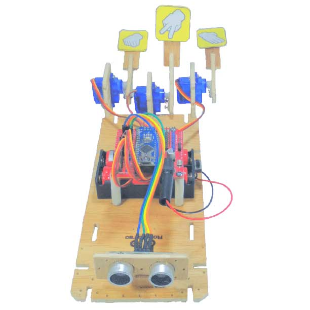
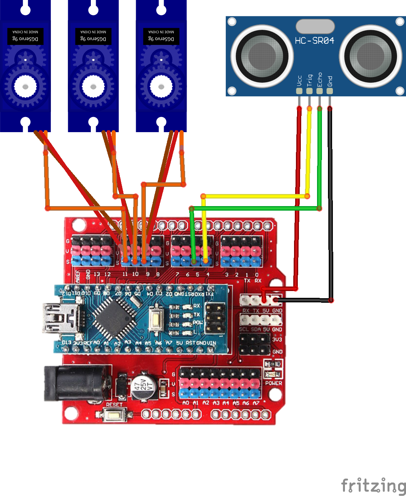

import Tabs from '@theme/Tabs';
import TabItem from '@theme/TabItem';

# Rock Paper Scissors Game with Servo Motor 🗿📃✂️ 🎮

## Perkenalan

<div width="100%" style={{textAlign: 'center'}}>



</div>

RoboKarsa yakin kalau teman-teman semua pernah tahu atau paling tidak pernah bermain permainan Batu Kertas Gunting dengan temannya.

Namun bagaimana kalau teman kita sedang tidak ada ketika kita ingin bermain Batu Kertas Gunting?

Kalau begitu, mari kita jadikan robot sebagai lawan kita untuk bermain Batu Kertas Gunting.

Robot ini akan menggunakan Servo Motor untuk menggerakkan tangan nya ketika akan mengeluarkan jurus. Entah itu akan mengeluarkan Batu, Kertas, atau Gunting untuk melawan jurus yang kita keluarkan.

Kemudian kita akan menggunakan sensor Jarak agar robotnya bisa mendeteksi keberadaan tangan kita ketika sudah mengeluarkan jurus kita.

Tanpa bicara panjang lebar lagi, mari kita langsung saja membuatnya.

## Alat dan Komponen yang diperlukan

<Tabs className="unique-tabs">
<TabItem value="Alat 🛠">

- Obeng Plus

</TabItem>

<TabItem value="Komponen Yang Dibutuhkan 🔑">

- 1 x Arduino Nano
- 1 x Kabel USB Arduino Nano
- 1 x Komputer/Laptop
- 3 x Servo
- 3 X Lengan Robot
- 1 x Sensor Jarak Ultrasonik
- 1 x Kotak Baterai 2 Slot
- 2 x Baterai
- Baut seperlunya
- Kabel Jumper seperlunya

</TabItem>
</Tabs>

## Petunjuk Merakit

### ◼️ Merakit Komponen Utama

#### ▪️ Memasang Kotak Baterai

1. Siapkan komponen pertama, yakni rangka utama.

   <p align="center" width="100%"> </p>

2. Kemudian siapkan kotak baterai seperti ditunjukkan oleh gambar di bawah.

   <p align="center" width="100%"> </p>

3. Perhatikan bahwa terdapat dua buah lubang pada kotak baterai seperti yang ditunjukkan oleh tanda panah putih nomor satu dan dua.
   <p align="center" width="100%"> </p>

   Lubang pada kotak baterai tersebut sejajar dengan lubang pada rangka utama seperti yang ditunjukkan oleh tanda panah hitam nomor satu dan dua.

   <p align="center" width="100%"> </p>

4. Lubang tersebut akan dijadikan sebagai lubang untuk memasang baut. Contoh baut yang telah terpasang ditunjukkan seperti pada gambar di bawah ini
   <p align="center" width="100%"> </p>

5. Baik, sekarang kotak baterai telah terpasang, hasilnya akan seperti pada gambar di bawah ini.
   <p align="center" width="100%"> </p>

   Selanjutnya kita akan memasang baterai pada kotak baterai.

#### ▪️ Memasang Baterai

6. Setelah kotak baterai terpasang, kita akan memasang baterai. Siapkan dua buah baterai seperti pada gambar di bawah ini.
   <p align="center" width="100%"> </p>

7. Masukkan baterai ke kotak baterai. Perhatikan, kutub negatif baterai yang ditandai oleh tanda negatif ➖, masuk terlebih dahulu ke pegas pada kotak baterai.
   <p align="center" width="100%"> </p>

   Hasilnya akan seperti pada gambar di bawah ini.
   <p align="center" width="100%"> </p>

   Selanjutnya kita akan memasang baterai berikutnya.

8. Sama seperti langkah 7 di atas sebelumnya, masukkan baterai ke kotak baterai dengan kutub negatif baterai yang ditandai oleh tanda negatif ➖, masuk terlebih dahulu ke pegas pada kotak baterai.
   <p align="center" width="100%"> </p>

   Hasilnya akan seperti pada gambar di bawah ini.
   <p align="center" width="100%"> </p>

   Setelah kedua baterai terpasang pada kotak baterai, hasilnya akan menjadi seperti di bawah ini.
   <p align="center" width="100%"> </p>

#### ▪️ Memasang Arduino Nano

9. Selanjutnya kita akan memasang Arduino Nano ke rangka utama. Siapkan 4 buah spacer kertas dan Arduino Nano.
   <p align="center" width="100%"> </p>

   Bukalah baut pada keempat spacer kertas tersebut, kemudian pasangkan ke lubang baut pada Arduino Nano.

   <p align="center" width="100%"> </p>

10. Setelah keempat spacer kertas terpasang pada Arduino Nano, akan menjadi seperti ini.
    <p align="center" width="100%">

    

    

    </p>

11. Setelah keempat spacer kertas terpasang pada Arduino Nano, selanjutnya kita akan memasang Arduino Nano ke rangka utama. Namun sebelumnya, perhatikan terlebih dahulu lubang-lubang yang ditunjukkan oleh tanda panah putih pada gambar di bawah ini.
    <p align="center" width="100%"> </p>

    Kita akan menancapkan keempat kaki spacer kertas pada keempat lubang tersebut.

12. Tancapkan kaki spacer bagian depan Arduino Nano pada lubang. Setelah sejajar dengan lubang, tekan hingga masuk sepenuhnya.

    <p align="center" width="100%">

    

    

    </p>

13. Lakukan hal yang sama untuk dua kaki yang tersisa di belakangnya.

    <p align="center" width="100%">

    

    

    </p>

14. Apabila Arduino Nano telah terpasang pada rangka utama, maka hasilnya akan seperti pada gambar di bawah ini
    <p align="center" width="100%"> </p>

#### ▪️ Memasang Sensor Jarak Ultrasonik

15. Selanjutnya kita akan memasang sensor jarak ultrasonik ke rangka utama. Siapkan sensor jarak ultrasonik dan dudukannya seperti ditunjuk pada gambar di bawah ini.
    <p align="center" width="100%">

    

    </p>

16. Kemudian pasangkan sensor jarak ultrasonik ke dudukannya seperti pada gambar di bawah ini.
    <p align="center" width="100%">

    

    </p>

17. Setelah sensor jarak ultrasonik terpasang pada dudukannya, kita akan memasangkannya pada rangka utama seperti pada gambar di bawah ini
    <p align="center" width="100%">

    

    

    

    </p>

18. Maka hasil akhir setelah sensor jarak ultrasonik terpasang akan seperti pada gambar di bawah ini.
    <p align="center" width="100%">

    

    </p>

#### ▪️ Memasang Lengan Robot ke Servo

19. Selanjutnya, kita akan memasang servo untuk menggerakkan tangan robot. Siapkan tiga buah servo motor dan tiga buah tangan robot seperti yang ditunjukkan oleh gambar di bawah.
    <p align="center" width="100%">

    

    

    </p>

20. Kita akan memasang lengan robot ke servo. Namun sebelumnya, bukalah terlebih dahulu baut yang terpasang pada servo seperti ditunjukkan pada gambar di bawah. Harap jaga baut kecilnya dengan baik ya, teman-teman. Jangan sampai hi
    <p align="center" width="100%">

    

    

    </p>

21. Kemudian pasangkan lengan robot ke servo seperti pada gambar di bawah.
    <p align="center" width="100%">

    

    

    Sebelum lanjut ke langkah berikutnya, pastikan titik tengah roda gigi servo seperti yang ditunjuk oleh panah hitam sudah berada di tengah-tengah servo seperti pada gambar di bawah ini.
    Jika titik tengah roda gigi servo belum berada di tengah-tengah servo, putarlah secara manual dengan menggunakan lengan robot.

    
    </p>

22. Setelah lengan robot terpasang, kita kencangkan dengan memasang baut yang telah kita lepas sebelumnya pada langkah 16 tadi pada lubang yang ditunjuk oleh tanda panah.
    <p align="center" width="100%">

    

    
    </p>

23. Pasangkan lengan robot ke dua servo yang tersisa, sehingga kita mendapat tiga buah lengan robot seperti pada gambar di bawah ini.
    <p align="center" width="100%">

    

    </p>

#### ▪️ Memasang Lengan Robot ke Rangka Utama

24. Setelah ketiga lengan robot sudah siap, kita akan memasang ketiga nya ke rangka utama. Kita akan mulai dari lengan kiri terlebih dahulu. Pasang dengan posisi seperti pada gambar di bawah ini.

    <p align="center" width="100%">

    

    

    </p>

25. Kemudian kita akan memasang lengan tengah. Pasang dengan posisi seperti pada gambar di bawah ini.

    <p align="center" width="100%">

    

    

    </p>

26. Terakhir, kita akan memasang lengan kanan. Pasanglah dengan posisi seperti pada gambar di bawah ini.

    <p align="center" width="100%">

    

    

    </p>

27. Maka hasil akhir semua komponen terpasang pada rangka utama akan diperlihatkan seperti pada gambar di bawah ini.
    <p align="center" width="100%">

    

    </p>

### ◼️ Wiring Diagram

Jika sudah selesai memasang semua komponen ke rangka utama, selanjutnya kita akan merangkai dan menghubungkan komponen tersebut dengan kabel jumper.

#### ▪️ Diagram Gambar

Teman-teman bisa gunakan gambar Wiring Diagram di bawah ini sebagai petunjuk untuk merangkai kabel-kabelnya.

<div width="100%" style={{textAlign: 'center'}}>



</div>

#### ▪️ Diagram Tabel

Apabila titik ujung kabel pada gambar di atas kurang jelas, teman-teman bisa gunakan tabel di bawah ini.

<table>
<tr><th>Modul Servo </th><th>Ultrasonic Distance Sensor</th></tr>
<tr><td>

| Modul Servo  | Arduino Nano Expansion Board |
| :----------: | :--------------------------: |
|  Servo Kiri  |            Pin 9             |
| Servo Tengah |            Pin 10            |
| Servo Kanan  |            Pin 11            |

</td><td>

| Ultrasonic Distance Sensor | Arduino Nano Expansion Board |
| :------------------------: | :--------------------------: |
|            VCC             |              5V              |
|            Trig            |            Pin 4             |
|            Echo            |            Pin 5             |
|            GND             |             GND              |

</td></tr> </table>

## Mengetik Program

Kemudian ketik program di bawah ini. Setelah selesai mengetik, jalankan proses Verify. Setelah proses verify dan compiling selesai, upload programnya ke Arduino Nano.

```arduino title="RoboKarsa_Rock_Paper_Scissors_Game.ino" showLineNumbers
#include<Servo.h>
#include <Ultrasonic.h>

Ultrasonic ultrasonic(4, 5);
int distance;

int number=0;
int randomdelay=0;

Servo servo1;
Servo servo2;
Servo servo3;

// Variables will change:
int moveState = 0;         // current state of the move
int lastMoveState = 0;     // previous state of the move

void setup() {
  // initialize the LED as an output:
  pinMode(13, OUTPUT);
  // initialize serial communication:
  Serial.begin(9600);
  servo1.attach(9);
  servo2.attach(10);
  servo3.attach(11);

  //initialize starting servo sequence
  servo1.write(0);
  servo2.write(0);
  servo3.write(0);
  delay(300);
  servo1.write(90);
  delay(300);
  servo2.write(90);
  delay(300);
  servo3.write(90);
  delay(500);
  servo3.write(0);
  delay(150);
  servo2.write(0);
  delay(150);
  servo1.write(0);
  delay(150);
  servo1.write(90);
  servo2.write(90);
  servo3.write(90);
  delay(300);
  servo1.write(0);
  servo2.write(0);
  servo3.write(0);
}


void loop() {

  delay(100);                     // Wait 50ms between pings (about 20 pings/sec). 29ms should be the shortest delay between pings.
  Serial.print("Jarak: ");
  distance = ultrasonic.read();
  Serial.print(distance);
  Serial.println("cm");
  if (distance<=15){
    moveState=LOW;
  }
  else if(distance>=15){
    moveState=HIGH;
  }
  // compare the moveState to its previous state
  if (moveState != lastMoveState) {
    // if the state has changed, do the robot move
    if (moveState == HIGH) {

      digitalWrite(13,LOW);
      servo1.write(0);
      servo2.write(0);
      servo3.write(0);
    } else {
      number = random(3);
      Serial.println(number);
      digitalWrite(13,HIGH);
      if(number==0)
      {
        servo1.write(0);
        servo2.write(90);
        servo3.write(0);
        delay(2000);
        }
      else if(number==1)
      {
        servo1.write(0);
        servo2.write(0);
        servo3.write(90);
        delay(2000);
        }
      else if(number==2)
      {
        servo1.write(90);
        servo2.write(0);
        servo3.write(0);
        delay(2000);
        }
    }
    // Delay a little bit to avoid bouncing
    delay(50);
  }
  // save the current state as the last state, for next time through the loop
  lastMoveState = moveState;

}
```

<!-- ## In Action

Hasilnya akan seperti pada video pendek berikut -->
