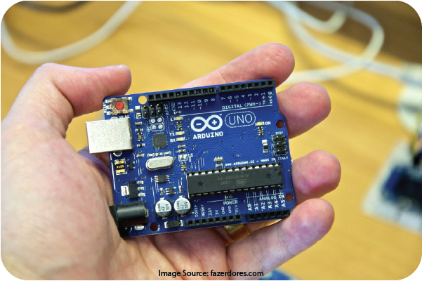
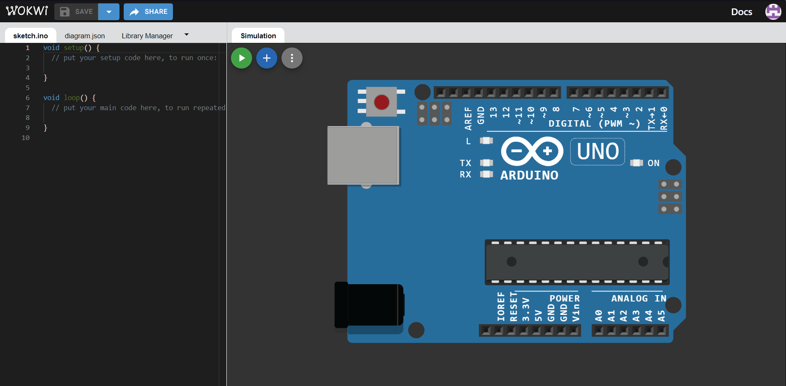
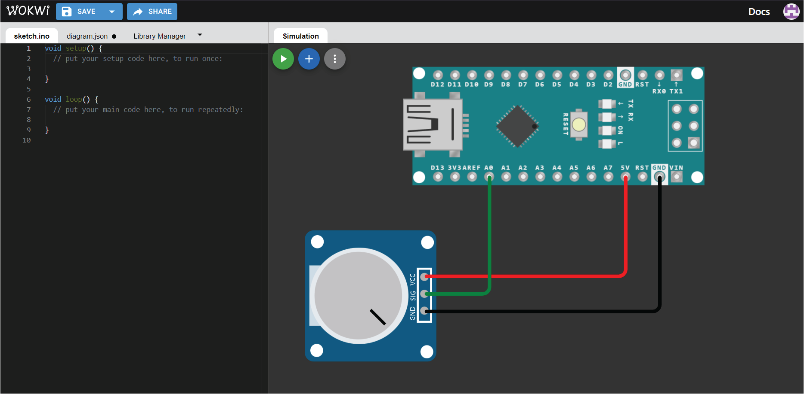

# Pendahuluan 📣

Halo, semuanya.

Tutorial ini khusus untuk memberikan penjelasan mengenai Wokwi.

Apa itu Wokwi?

Berdasarkan penjelasan singkat dari situs dokumentasi resminya, yang dapat teman-teman akses <a target="_blank" rel="noopener noreferrer" href="https://docs.arduino.cc/learn/starting-guide/getting-started-arduino#setup">**di sini**</a>, Wokwi adalah sebuah simulator elektronika online yang dapat kita akses melalui web browser tanpa harus melakukan instalasi apapun.

Apa itu simulator elektronika online?

Mari kita telaah satu persatu kata-kata tersebut. "Simulator" merupakan sebuah software/program yang dijalankan dalam komputer yang digunakan untuk mensimulasikan ataupun memvisualisasikan suatu objek atau benda nyata dalam media komputer dan ditampilkan pada layar komputer. Misalnya, kita ingin mensimulasikan bagaimana kecepatan air bergerak turun dengan sudut ketinggian yang berbeda.

Kemudian kata "elektronika", merupakan istilah untuk menggambarkan semua benda-benda yang beroperasi dengan prinsip elektronik dan membutuhkan arus dan tegangan listrik untuk beroperasi. Seperti baterai, lampu, motor listrik, dan sebagainya.

Terakhir, terdapat kata "online", yakni istilah yang digunakan untuk menyatakan bahwa suatu perangkat elektronika, seperti komputer, laptop, ataupun smartphone sedang terhubung ke suatu jaringan internet. Lawan kata dari "online" adalah "offline" yang berarti perangkat elektronika tersebut sedang tidak terhubung ke jaringan internet manapun.

Maka, secara keseluruhan, simulator elektronika online adalah sebuah software/program yang dijalankan secara online dalam komputer untuk mensimulasikan bagaimana cara kerja dan tingkah laku dari perangkat-perangkat elektronika.

Sebagai contoh, kita memiliki sebuah perangkat Arduino Uno seperti pada gambar di bawah ini

Perangkat tersebut merupakan benda nyata karena bisa disentuh, bisa dipegang, bisa dicium, dan bisa diraba secara langsung pada dunia nyata.

Sedangkan, jika kita semisalnya kita belum memiliki perangkat Arduino Uno tersebut, kita bisa menggunakan simulator Wokwi sehingga seolah-olah kita memiliki perangkat Arduino Uno, namun dalam bentuk simulasi dalam komputer seperti pada gambar di bawah ini

Arduino Uno dalam simulasi tersebut akan berfungsi sama persis seperti perangkat aslinya pada dunia nyata. Sehingga seolah-olah kita memiliki perangkat tersebut dalam komputer.

Bagaimana dengan perkabelan? Bukankah kita membutuhkan kabel untuk menghubungkan komponen yang satu dengan komponen lainnya? Bisakah Wokwi mensimulasikan kabel tersebut? Tentu saja bisa.

Ambillah sebagai contoh pada rangkaian yang dibuat pada dunia nyata seperti pada gambar di bawah ini. Rangkaian di bawah ini menghubungkan Arduino Nano dengan Potensiometer dengan urutan pemasangan kaki-kaki seperti berikut

| Potensiometer | Arduino Nano Expansion Board |
| :-----------: | :--------------------------: |
|    Pin OUT    |            Pin A0            |
|    Pin GND    |            Pin G             |
|    Pin VCC    |            Pin V             |

Maka, jika kita ingin mensimulasikan rangkaian di atas dalam Wokwi, hasilnya akan menjadi seperti di bawah ini

Tentu saja masih ada beberapa perbedaan, seperti rangkaian di dunia nyata menggunakan Arduino Nano Shield yang berwarna merah, sedangkan pada simulasi, tidak terdapat Arduino Nano Shield. Hal ini dikarenakan ada beberapa komponen di dunia nyata yang belum dimiliki oleh simulator Wokwi.

Namun, tentu saja, fungsi yang dijalankan oleh simulator Wokwi sama persis seperti yang terjadi pada dunia nyata.

Oh iya, tentu saja, simulator Wokwi ini tentunya dapat diakses secara gratis oleh siapapun. Kita hanya membutuhkan email untuk membuat akun pada Wokwi terlebih dahulu untuk dapat memanfaatkan fungsi-fungsinya.

Sehingga simulator Wokwi sangat ideal untuk digunakan jika ingin belajar tentang elektronika dan pemrograman robotika jika kita belum bisa memiliki perangkat yang dibutuhkan.

Tentunya, kita akan mengulas dan memberikan panduan tentang bagaimana cara menggunakan simulator Wokwi dengan belajar tentangnya terlebih dahulu.
